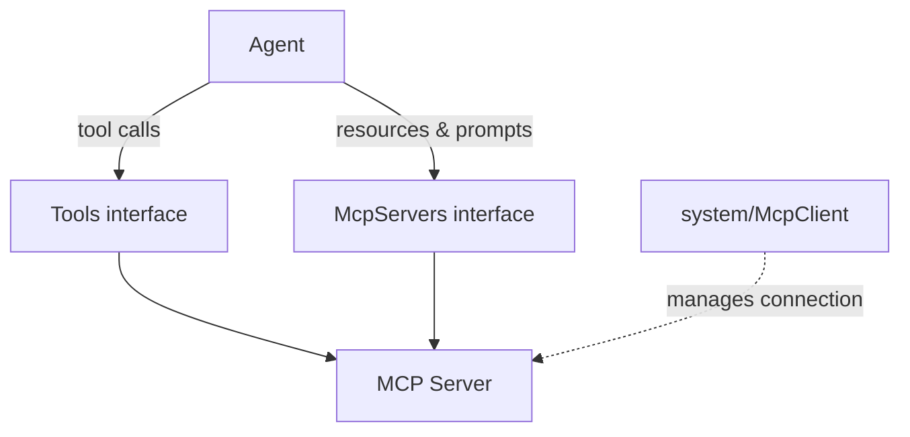

<Callout type="warn">
  This interface is experimental. No real implementation exists yet. The API surface
  may change as the MCP ecosystem and OS Protocol integration patterns mature.
</Callout>

## Overview

`McpServers` is the agent-facing interface for MCP-specific capabilities that go beyond tool execution. Resources (data and content exposed by a server) and prompts (reusable templates) are accessed through this interface. Tool execution from MCP servers goes through the unified Tools interface, not here. Connection management and server lifecycle are handled at the infrastructure level by `system/mcp-client`. Provider analogues include Anthropic MCP and the AAIF MCP Standard.

## Architecture



## TypeScript API

```ts
import type { McpServers, McpResource, McpPrompt } from "@osprotocol/schema/actions/mcp-servers"
```

### McpResource

Represents a data or content resource exposed by an MCP server.

```ts
interface McpResource {
  uri: string
  name: string
  mimeType?: string
  description?: string
  metadata?: Record<string, unknown>
}
```

| Field | Type | Description |
|---|---|---|
| `uri` | `string` | Unique resource identifier within the server |
| `name` | `string` | Human-readable resource name |
| `mimeType` | `string` | Optional MIME type of the resource content |
| `description` | `string` | Optional description of what the resource contains |
| `metadata` | `Record<string, unknown>` | Optional server-defined metadata |

### McpPrompt

Represents a reusable prompt template provided by an MCP server.

```ts
interface McpPrompt {
  name: string
  description?: string
  arguments?: object
  metadata?: Record<string, unknown>
}
```

| Field | Type | Description |
|---|---|---|
| `name` | `string` | Unique prompt name within the server |
| `description` | `string` | Optional description of the prompt's purpose |
| `arguments` | `object` | Optional argument schema for the prompt |
| `metadata` | `Record<string, unknown>` | Optional server-defined metadata |

### McpServers

The primary interface agents use to interact with MCP server resources and prompts.

```ts
interface McpServers {
  listResources(server: string): Promise<McpResource[]>
  readResource(server: string, uri: string): Promise<string | null>
  listPrompts(server: string): Promise<McpPrompt[]>
  getPrompt(server: string, name: string, args?: Record<string, string>): Promise<string | null>
}
```

| Method | Description |
|---|---|
| `listResources(server)` | List all resources available on the given MCP server |
| `readResource(server, uri)` | Read the content of a specific resource by URI |
| `listPrompts(server)` | List all prompt templates available on the given MCP server |
| `getPrompt(server, name, args?)` | Retrieve a rendered prompt by name, optionally passing arguments |

## Usage Examples

### List and read resources from a server

```ts
const resources = await mcp.listResources("knowledge-base")

for (const resource of resources) {
  console.log(`${resource.name} (${resource.mimeType ?? "unknown type"})`)
}

const content = await mcp.readResource("knowledge-base", "docs://api-reference")
if (content) {
  // process the resource content
}
```

### Get a prompt with arguments

```ts
const rendered = await mcp.getPrompt("code-assistant", "explain-function", {
  language: "typescript",
  context: "async generator",
})

if (rendered) {
  // use the rendered prompt text in an LLM call
}
```

### Discover what an MCP server offers

```ts
const [resources, prompts] = await Promise.all([
  mcp.listResources("my-server"),
  mcp.listPrompts("my-server"),
])

console.log(`Resources: ${resources.map((r) => r.name).join(", ")}`)
console.log(`Prompts: ${prompts.map((p) => p.name).join(", ")}`)
```

## Integration

- [Tools](/docs/actions/tools) — unified interface for tool execution, including tools from MCP servers
- [MCP Client](/docs/system/mcp-client) — infrastructure-level connection management for MCP servers
- [SystemActions](/docs/actions/system) — broader system actions context
