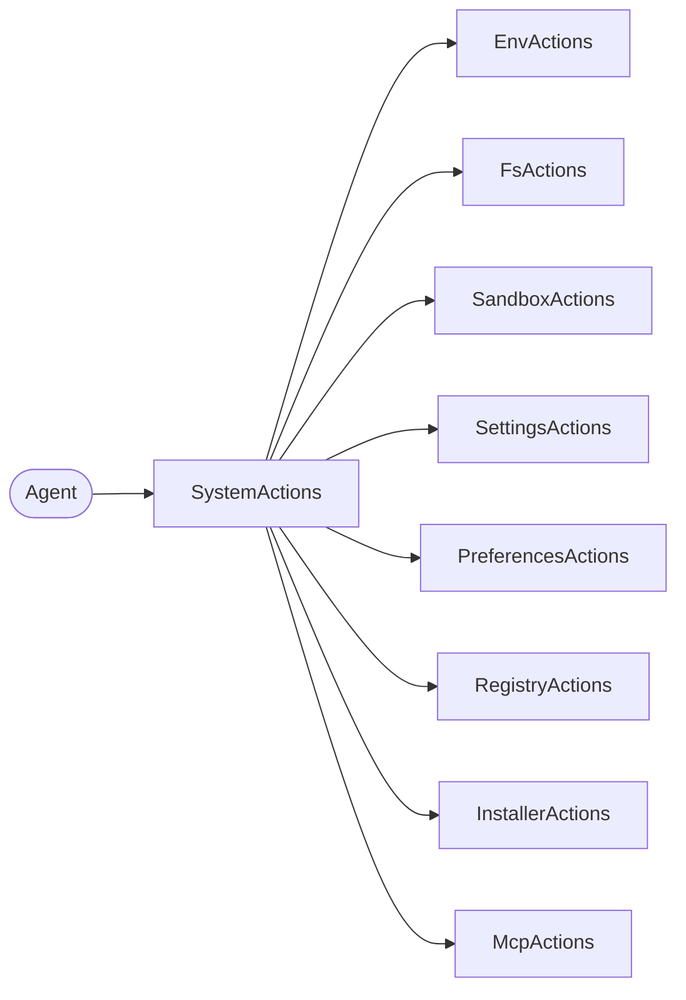

<Callout type="warn">
  This interface is experimental — no production implementation exists yet.
  The API surface may change.
</Callout>

## Overview

System Actions composes all system write interfaces into a single entry point for the actions phase of the agent loop. It is a pure facade — each system API owns its own Actions interface, and `SystemActions` re-exports them under a unified namespace.

The read counterpart is [System Context](/docs/context/system), which provides read-only access to the same system interfaces.



## TypeScript API

```ts
import type { SystemActions } from '@osprotocol/schema/actions/system'
```

### SystemActions

Composes all system write interfaces.

```ts
interface SystemActions {
  /** Environment variables */
  env: EnvActions
  /** System-wide settings */
  settings: SettingsActions
  /** Scoped preferences */
  preferences: PreferencesActions
  /** Resource registries */
  registry: RegistryActions
  /** Host filesystem */
  fs: FsActions
  /** Sandbox environments */
  sandbox: SandboxActions
  /** Installed packages */
  installer: InstallerActions
  /** MCP server connections */
  mcp: McpActions
}
```

Individual Actions interfaces are also re-exported:

```ts
import type {
  EnvActions,
  SettingsActions,
  PreferencesActions,
  RegistryActions,
  FsActions,
  SandboxActions,
  InstallerActions,
  McpActions,
} from '@osprotocol/schema/actions/system'
```

## Usage Examples

### Mutate system state through the facade

```ts
// Set an environment variable
await system.env.set({ key: 'DATABASE_URL', value: 'postgres://...' })

// Create a sandbox for code execution
const sandbox = await system.sandbox.create({ runtime: 'node24', timeout: 60000 })

// Install a dependency
await system.installer.install({ name: '@osprotocol/schema', version: '^0.2.0' })
```

### Use individual Actions interfaces directly

```ts
// When you only need filesystem write access
async function saveArtifact(fs: FsActions, path: string, content: string) {
  await fs.write(path, content)
}
```

## Design Rationale

The agent loop enforces read/write separation by phase:

- **Context phase** → read-only (`SystemContext` in `context/system.ts`)
- **Actions phase** → write operations (`SystemActions` in `actions/system.ts`)

This zero-trust pattern ensures agents gather all context before mutating state. The facade is pure composition — it adds no logic, just groups the individual Actions interfaces for convenience.

## Integration

System Actions integrates with:

- **[System Context](/docs/context/system)**: Read counterpart — same interfaces, read-only view
- **[Tools](/docs/actions/tools)**: System mutations can be exposed as agent tools
- **[Checks](/docs/checks/audit)**: Audit trails record system mutations for verification
