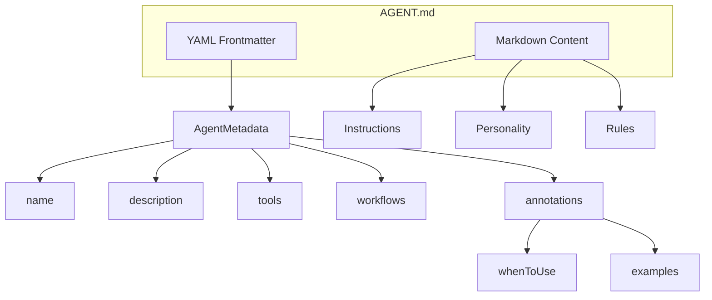

## Overview

Agents are the primary actors in the OS Protocol. Each agent is defined in an `AGENT.md` file with YAML frontmatter metadata and markdown content containing instructions, personality, and rules.



## AGENT.md Structure

```markdown
---
name: my-agent
description: A helpful assistant agent
version: 1.0.0
extends: base-agent
tools:
  - fs.read
  - checks.rules
workflows:
  - routing
  - parallelization
annotations:
  whenToUse:
    - "When user needs help with file operations"
  examples:
    - "Read the contents of config.json"
---

# My Agent

Your agent instructions, personality, and rules go here in markdown.
```

## TypeScript API

```ts
import type {
  Agent,
  AgentMetadata,
  AgentAnnotations,
  AgentRegistryEntry
} from '@osprotocol/schema/agent'
```

### Agent

The full agent definition including metadata and content.

```ts
interface Agent {
  /** Metadata from YAML frontmatter */
  metadata: AgentMetadata
  /** Markdown content (instructions, personality, rules) */
  content: string
  /** File path where agent was loaded from */
  path: string
}
```

### AgentMetadata

Metadata extracted from the YAML frontmatter in `AGENT.md`.

```ts
interface AgentMetadata {
  /** Unique identifier for the agent */
  name: string
  /** Human-readable description */
  description: string
  /** Semantic version (optional) */
  version?: string
  /** Parent agent to extend from (optional) */
  extends?: string
  /** Tools this agent has access to (e.g., 'fs.read', 'checks.rules') */
  tools?: string[]
  /** Workflow patterns this agent can use (e.g., 'routing', 'parallelization') */
  workflows?: string[]
  /** Discovery annotations */
  annotations?: AgentAnnotations
}
```

### AgentAnnotations

Annotations for agent discovery and routing. Used by routing workflows to determine which agent should handle a given task.

```ts
interface AgentAnnotations {
  /** Conditions under which this agent should be used */
  whenToUse: string[]
  /** Example inputs/tasks this agent handles well */
  examples?: string[]
}
```

### AgentRegistryEntry

Registry entry for agent discovery. Used by the system registry to track available agents.

```ts
interface AgentRegistryEntry {
  /** Agent name */
  name: string
  /** Agent description */
  description: string
  /** File path to AGENT.md */
  path: string
  /** Whether agent definition has been loaded */
  loaded: boolean
  /** Optional parent agent name */
  extends?: string
}
```

## Integration

Agents integrate with:

- **Registry**: Agents are registered for discovery
- **Routing**: Annotations enable intelligent task routing
- **Workflows**: Agents use workflow patterns for execution
- **Tools**: Agents access tools from protocol domains
