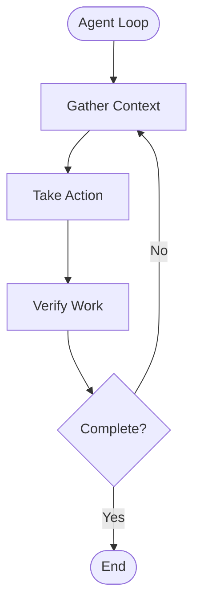
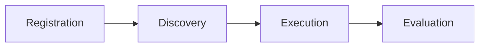

## Overview

The Agentic OS Protocol (OSP) is built on a modular architecture that separates concerns and enables flexible composition of agent systems.

## Philosophy and Foundations

OSP doesn't create everything from scratch. Instead, it adapts proven philosophies and patterns that have demonstrated effectiveness in production environments, combined with our own contributions and experience in infrastructure design.

### Influences and Adaptations

OSP draws inspiration from several key sources:

- **[Anthropic: Building Effective Agents](https://www.anthropic.com/engineering/building-effective-agents)**: Workflow patterns (Routing, Prompt Chaining, Orchestrator-Workers, Parallelization, Evaluator-Optimizer) form the foundation of our workflow taxonomy.
- **[Agent Communication Protocol](https://agentcommunicationprotocol.dev/core-concepts/agent-run-lifecycle)**: The concept of **Runs**—essential for multi-agent systems—provides the lifecycle management framework.
- **[Claude Agent SDK](https://www.anthropic.com/engineering/building-agents-with-the-claude-agent-sdk)**: The **Agent Loop** execution pattern (Gather Context → Take Action → Verify Work → Iterate) defines our core cognitive cycle.

These patterns have been adapted and extended to work together in a unified protocol specification that emphasizes interoperability, scalability, and system-level orchestration.

### The Operating System Concept

Where OSP contributes uniquely is in the **Operating System** abstraction—a layer that provides system intelligence through standardized APIs. This OS layer manages the lifecycle, coordination, and resource management that multi-agent systems require.

> **Understanding the Metaphor**: Just as traditional operating systems abstract hardware resources (CPU, memory, disk), an Agentic OS abstracts cognitive resources (inference, context, knowledge, tools). The [Agentic OS concept](/docs/concepts/agentic-os) defines this paradigm—OSP is the protocol specification that implementations follow.

Just as traditional operating systems provide process management, memory management, and I/O interfaces, OSP's Operating System provides:

- **Agent Registry**: Discovery and capability management
- **System APIs**: Environment, Filesystem, Settings, Sandbox
- **Context Facades**: System Context, Embeddings, Key-Value
- **Quality Assurance**: Rules, Audit, Judge, Screenshot

## Architecture Layers

The protocol architecture is organized into distinct domains:

### 1. System (Infrastructure)

The OS layer provides infrastructure services that all agents depend on. Unlike traditional protocols that focus solely on agent-to-agent communication, OSP includes system-level intelligence:

- **Registry**: Manages agent registration, discovery, and capability matching
- **Environment**: Handles configuration and environment variable management
- **Filesystem**: Provides standardized file system operation interfaces
- **Sandbox**: Isolated execution environments for untrusted code
- **Settings**: Manages system-level configurations
- **Preferences**: User-level preferences and personalization
- **Installer**: Package and dependency management
- **MCP Client**: Integrates with Model Context Protocol for external tool access

### 2. Context & Actions (Read/Write Facades)

OSP separates read-only information gathering from state-changing operations. This mirrors the Agent Loop phases: **gather** context, then **take** action.

**Context** (read-only facades for the gather phase):

- **System Context**: Aggregated read-only view of system state (environment, settings, filesystem metadata)
- **Embeddings**: Vector database integration for semantic search
- **Key-Value**: Lightweight key-value storage for agent state

**Actions** (write facades for the act phase):

- **System Actions**: Aggregated write operations (filesystem writes, setting changes)
- **Tools**: Tool registration and invocation interfaces
- **MCP Servers**: External tool access through Model Context Protocol servers

### 3. Checks (Quality Assurance)

Built-in mechanisms for ensuring reliability, compliance, and quality:

- **Rules**: Behavioral constraints and validation frameworks
- **Judge**: LLM-based evaluation of agent outputs and decisions
- **Audit**: Comprehensive monitoring and logging of agent behavior
- **Screenshot**: Visual validation for UI-related tasks

### 4. Workflows (Execution Patterns)

Composable patterns for agent coordination, based on [Anthropic's building blocks for agentic systems](https://www.anthropic.com/engineering/building-effective-agents):

- **Routing**: Classify input and delegate to the appropriate handler
- **Parallelization**: Split work across parallel branches and merge results
- **Orchestrator-Workers**: Plan, delegate to workers, synthesize outputs
- **Evaluator-Optimizer**: Generate, evaluate, refine in a loop

### 5. Runs (Lifecycle Control)

Every agent execution is a **Run** with a well-defined lifecycle and control mechanisms:

- **Timeout**: Time-based execution limits
- **Retry**: Automatic retry with configurable strategies
- **Cancel**: Graceful cancellation with cleanup
- **Approval**: Human-in-the-loop gates for sensitive operations

## Core Execution Model

### The Agent Loop

At the heart of every agent is the **Agent Loop**, the cognitive cycle that drives execution:

This loop executes within workflows and is managed by the Operating System during the Execution phase of the Agent Lifecycle.

Learn more: [Agent Loop](/docs/concepts/agent-loop)

### The Agent Lifecycle

At the system level, agents follow a **Lifecycle** that spans their entire existence:

- **Registration**: Agents declare capabilities to the Registry
- **Discovery**: The OS matches agents to tasks based on capabilities
- **Execution**: The Agent Loop runs within workflows
- **Evaluation**: Performance, quality, and compliance are assessed

Learn more: [Agent Lifecycle](/docs/concepts/lifecycle)

## Integration Patterns

OSP is designed to integrate with existing protocols and systems:

### MCP Integration

OSP includes native support for the Model Context Protocol, allowing agents to access external tools and resources through standardized MCP servers. The OS provides MCP client functionality that any agent can leverage.

### Workflow Orchestration

The protocol defines workflow patterns that can be composed and combined. Workflows handle coordination; Runs handle lifecycle control (timeouts, retries, cancellation, approval).

Learn more: [Workflows](/docs/workflows) · [Runs](/docs/runs)

### Multi-Agent Coordination

OSP enables agents from different implementations to work together through standardized interfaces. Agents can coordinate tasks, share context (with proper isolation), and participate in distributed workflows.

## Design Philosophy

The architecture prioritizes:

- **Modularity**: Components can be used independently or together
- **Extensibility**: New components and capabilities can be added without breaking existing implementations
- **Interoperability**: Different implementations can work together through standardized contracts
- **Reliability**: Built-in quality assurance through Rules, Audit, and Judge
- **Observability**: Comprehensive monitoring, auditing, and evaluation capabilities
- **Scalability**: Designed to grow from single-agent systems to complex multi-agent environments

## Next Steps

- Learn about **[System](/docs/system)** for infrastructure services
- Understand **[Context](/docs/context)** and **[Actions](/docs/actions)** for the read/write split
- Review **[Checks](/docs/checks)** for quality assurance mechanisms
- Explore **[Workflows](/docs/workflows)** for coordination patterns
- See **[Runs](/docs/runs)** for lifecycle control