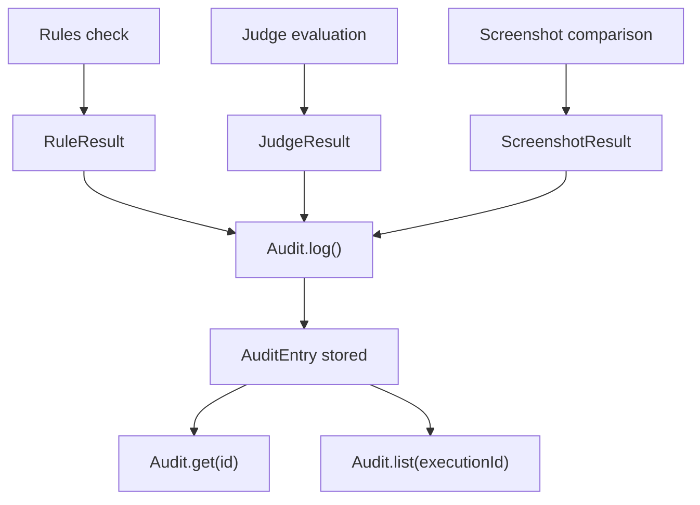

<Callout type="warn">
  This interface is experimental. No stable implementation exists yet.
  The API may change without notice in future versions of OS Protocol.
</Callout>

## Overview

The audit trail records every verification result produced during agent execution. Every check — rules evaluation, judge scoring, screenshot comparison — is logged as an `AuditEntry` with its outcome. This gives operators a complete, retrievable record for compliance, debugging, and trust scoring. Provider analogues: GitHub Audit Log, Datadog, Braintrust Logs, LangSmith Traces.

## Audit Flow



## TypeScript API

```ts
import type { AuditEntry, Audit } from '@osprotocol/schema/checks/audit'
```

### AuditEntry

A single record of a verification event. Created automatically by `Audit.log()` with a generated `id` and `createdAt` timestamp.

```ts
interface AuditEntry {
  id: string
  createdAt: number
  agentId?: string
  executionId?: string
  ruleResults?: RuleResult[]
  judgeResult?: JudgeResult
  passed: boolean
  metadata?: Record<string, unknown>
}
```

`ruleResults` and `judgeResult` reference types from the [Rules](/docs/checks/rules) and [Judge](/docs/checks/judge) interfaces respectively.

### Audit

The interface for logging and retrieving audit entries. Implementations are provided by the observability layer (e.g., Datadog, Braintrust, a custom database).

```ts
interface Audit {
  log(entry: Omit<AuditEntry, 'id' | 'createdAt'>): Promise<AuditEntry>
  get(id: string): Promise<AuditEntry | null>
  list(executionId: string): Promise<AuditEntry[]>
}
```

- `log` — Records a verification result and returns the stored `AuditEntry` with generated `id` and `createdAt`.
- `get` — Retrieves a single entry by its `id`. Returns `null` if not found.
- `list` — Returns all entries associated with a given `executionId`, ordered by creation time.

## Usage Examples

### Log a verification result

```ts
const entry = await audit.log({
  agentId: 'agent-42',
  executionId: 'exec-7f3a',
  ruleResults: [
    { ruleId: 'no-pii', passed: true },
    { ruleId: 'response-length', passed: false, reason: 'Exceeded 500 tokens' },
  ],
  passed: false,
  metadata: { model: 'claude-opus-4-6', latencyMs: 312 },
})

console.log(entry.id, entry.createdAt)
```

### Retrieve the audit trail for an execution

```ts
const entries = await audit.list('exec-7f3a')

for (const entry of entries) {
  console.log(`[${entry.id}] passed=${entry.passed}`)
}
```

### Check if all entries in an execution passed

```ts
const entries = await audit.list('exec-7f3a')
const allPassed = entries.every((e) => e.passed)

if (!allPassed) {
  const failed = entries.filter((e) => !e.passed)
  console.warn(`${failed.length} verification(s) failed in this execution`)
}
```

## Integration

- [Rules](/docs/checks/rules) — Produces `RuleResult[]` entries that get logged via `Audit.log()`.
- [Judge](/docs/checks/judge) — Produces `JudgeResult` entries that get logged via `Audit.log()`.
- [Screenshot](/docs/checks/screenshot) — Visual comparison results can be included in audit entries.
- [Approval](/docs/runs/approval) — Approval decisions may reference audit entries when determining whether to proceed.
