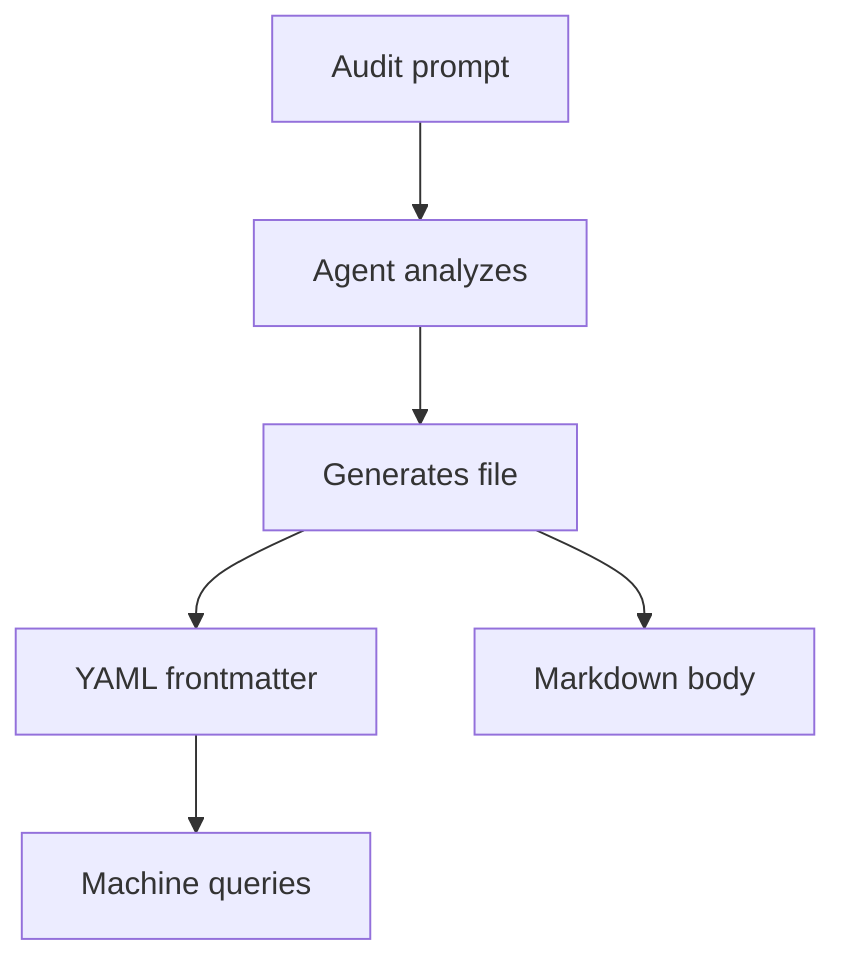

## Overview

Agents generate formal audit reports as markdown files with YAML frontmatter. The frontmatter conforms to the `AuditEntry` schema, enabling machine-parseable compliance records.

The schema is aligned with **ISO 27001** audit reporting and **ISACA/ITAF** expression of opinion standards.

**Implementation patterns:** gray-matter, Contentlayer, Fumadocs.
**Consumers:** Drata, Scytale (compliance automation), LangSmith, Langfuse (agent observability).

## Audit Flow



## Schema

```ts
import type {
  AuditEntry,
  AuditOpinion,
  AuditFindings,
  AuditQuery,
  Audit,
} from 'osprotocol/checks/audit'
```

### AuditOpinion

ISACA expression of opinion.

```ts
type AuditOpinion =
  | 'unqualified'  // No significant issues, full compliance
  | 'qualified'    // Minor issues that don't affect overall compliance
  | 'adverse'      // Significant issues, non-compliant
  | 'disclaimer'   // Unable to form opinion (insufficient evidence)
```

### AuditFindings

Finding severity counts aligned with ISO 27001 non-conformity classification.

```ts
interface AuditFindings {
  critical: number  // Immediate action required
  major: number     // Should be addressed soon
  minor: number     // Low risk, normal course
}
```

### AuditEntry

Schema for the YAML frontmatter in audit report files.

```ts
interface AuditEntry {
  id: string
  createdAt: number
  agentId?: string
  executionId?: string

  // ISO 27001 / ISACA fields
  objectives: string        // What the audit aims to determine
  scope: string[]           // Files, systems, or processes audited
  opinion: AuditOpinion     // Expression of opinion
  findings: AuditFindings   // Counts by severity

  // Detailed results (optional)
  ruleResults?: RuleResult[]
  judgeResult?: JudgeResult
  metadata?: Record<string, unknown>
}
```

### AuditQuery

Filter criteria for querying audit entries.

```ts
interface AuditQuery {
  opinion?: AuditOpinion | AuditOpinion[]
  minCritical?: number
  minMajor?: number
  agentId?: string
  executionId?: string
  since?: number  // Unix ms
  until?: number  // Unix ms
}
```

### Audit

Operations for parsing, writing, and querying audit entries.

```ts
interface Audit {
  parse(content: string): AuditEntry
  write(entry: Omit<AuditEntry, 'id' | 'createdAt'>, body: string): string
  query(query: AuditQuery): Promise<AuditEntry[]>
}
```

- `parse` — Extract `AuditEntry` from file content with YAML frontmatter
- `write` — Generate file content from entry and markdown body
- `query` — Find entries matching filter criteria

## Agentic Usage

### Prompt

```
Audit the production configuration files
```

### Output

File: `audits/2026-02-21-config-review.md`

```yaml
---
type: audit
date: 2026-02-21
agent: reviewer
objectives: "Verify configuration files follow security best practices"
scope:
  - config/production.yaml
  - config/staging.yaml
status: complete
opinion: qualified
findings:
  critical: 0
  major: 1
  minor: 2
---

## Criteria

- Security best practices
- Secret management
- Environment isolation

## Findings

### Major

**M1: Hardcoded API endpoint**
Production config contains hardcoded URL instead of environment variable...

### Minor

**m1: Missing timeout configuration**
...

## Recommendations

**M1**: Use environment variable for API endpoint
...

## Conclusion

Configuration is mostly secure but contains one hardcoded value that
should be externalized. Qualified opinion issued.
```

### Querying Audits

The frontmatter is machine-parseable:

```bash
# Find audits with critical findings
grep -l "critical: [1-9]" audits/*.md

# Find adverse opinions
grep -l "opinion: adverse" audits/*.md
```

Or programmatically via the `Audit` interface:

```ts
const critical = await audit.query({ minCritical: 1 })
const adverse = await audit.query({ opinion: 'adverse' })
```

## Standards Mapping

| AuditEntry Field | ISO 27001 | ISACA/ITAF |
|------------------|-----------|------------|
| `objectives` | Scope and Objectives | Objectives of the Audit |
| `scope` | Scope and Objectives | Scope of Engagement |
| `opinion` | Audit Conclusion | Expression of Opinion |
| `findings` | Non-Conformities | Findings with Severity |
| `ruleResults` | Evidence | Supporting Data |
| `judgeResult` | Evaluation | Quality Assessment |

## Integration

- [Rules](/docs/checks/rules) — `RuleResult[]` can be included in audit entries as evidence.
- [Judge](/docs/checks/judge) — `JudgeResult` can be included for quality assessment.
- [Screenshot](/docs/checks/screenshot) — Visual comparison results can support findings.
