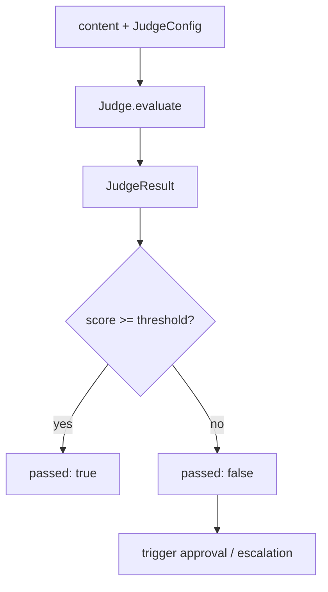

<Callout type="warn">
  This interface is **experimental**. No real implementation exists yet.
  The API shape may change before stabilization.
</Callout>

## Overview

`Judge` is the checks-phase interface for LLM-as-judge evaluation. It uses a model to score agent output against quality criteria, returning a numeric score (0–1), a pass/fail result, and natural-language reasoning. Results can optionally include a per-criterion breakdown via `ruleResults`, feed into audit records, and trigger approval flows when a score falls below threshold.

Provider analogues: OpenAI Evals, Braintrust Scorers, LangSmith Evaluators, Arize Phoenix.

## Evaluation Flow



## TypeScript API

```ts
import type { JudgeConfig, JudgeResult, Judge } from '@osprotocol/schema/checks/judge'
```

### JudgeConfig

```ts
interface JudgeConfig {
  model?: string
  criteria: string
  threshold?: number
  metadata?: Record<string, unknown>
}
```

| Field | Type | Description |
|---|---|---|
| `model` | `string` | Model identifier to use as judge. Falls back to provider default when omitted. |
| `criteria` | `string` | Natural-language description of what constitutes a passing result. Required. |
| `threshold` | `number` | Minimum score (0–1) for `passed: true`. Defaults to provider-defined value when omitted. |
| `metadata` | `Record<string, unknown>` | Arbitrary metadata attached to this evaluation run. |

### JudgeResult

```ts
interface JudgeResult {
  score: number
  passed: boolean
  reasoning: string
  ruleResults?: RuleResult[]
  metadata?: Record<string, unknown>
}
```

| Field | Type | Description |
|---|---|---|
| `score` | `number` | Numeric quality score in the range 0–1. |
| `passed` | `boolean` | `true` when `score >= threshold`. |
| `reasoning` | `string` | Model-generated explanation for the score. |
| `ruleResults` | `RuleResult[]` | Optional per-criterion breakdown from linked rules. |
| `metadata` | `Record<string, unknown>` | Arbitrary metadata returned by the judge. |

### Judge

```ts
interface Judge {
  evaluate(content: unknown, config: JudgeConfig): Promise<JudgeResult>
}
```

`evaluate` accepts any `content` value (string, object, or structured output) and a `JudgeConfig`, and returns a `Promise<JudgeResult>`.

## Usage Examples

### Basic evaluation

```ts
const result = await judge.evaluate(agentOutput, {
  criteria: 'The response must be factually accurate, concise, and free of harmful content.',
  threshold: 0.8,
})

console.log(result.passed)    // true | false
console.log(result.score)     // e.g. 0.92
console.log(result.reasoning) // "The response was accurate and well-scoped..."
```

### Breakdown by criteria using ruleResults

```ts
const result = await judge.evaluate(agentOutput, {
  model: 'claude-opus-4-6',
  criteria: 'Evaluate accuracy, tone, and completeness separately.',
  threshold: 0.75,
})

if (result.ruleResults) {
  for (const rule of result.ruleResults) {
    console.log(rule.name, rule.passed, rule.score)
  }
}
```

### Conditional approval trigger

```ts
const result = await judge.evaluate(agentOutput, {
  criteria: 'Output must not contain PII and must follow the brand voice guide.',
  threshold: 0.9,
})

if (!result.passed) {
  // Route to human approval before publishing
  await approvalGate.request({
    reason: result.reasoning,
    score: result.score,
  })
}
```

## Rules vs Judge

| | Rules | Judge |
|---|---|---|
| Evaluation method | Deterministic / programmatic | LLM-based qualitative evaluation |
| Output | Pass/fail per rule | Score (0–1) + reasoning |
| Best for | Schema validation, format checks, required fields | Tone, accuracy, helpfulness, nuanced quality |
| Latency | Low | Higher (model call required) |
| Cost | None | Model inference cost |
| Auditability | Exact rule match | Natural-language reasoning |

Use `Rules` for hard constraints and `Judge` for qualitative grading where human-like judgment is required.

## Integration

- [Rules](/docs/checks/rules) — deterministic checks whose results can be surfaced as `ruleResults` inside a `JudgeResult`
- [Audit](/docs/checks/audit) — `JudgeResult` records are written to the audit log for traceability
- [Approval](/docs/runs/approval) — when `passed` is `false`, evaluation results can trigger a human approval gate before execution continues
