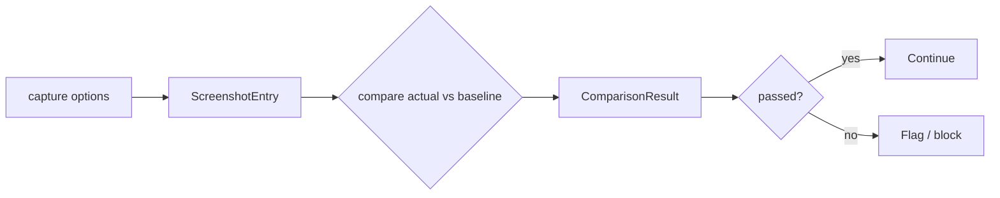

<Callout type="warn">
  This interface is experimental. No implementation exists yet.
  The API shape may change before stabilization.
</Callout>

## Overview

Screenshot provides visual capture and baseline comparison for visual regression detection within the checks phase. Providers include Playwright, Puppeteer, Browserbase, and ScreenshotOne. Comparison results feed into the audit trail alongside rule and judge results, giving a complete picture of agent output quality.

## Capture and compare flow



## TypeScript API

```ts
import type {
  ImageFormat,
  ScreenshotOptions,
  ScreenshotEntry,
  ComparisonResult,
  Screenshot,
} from 'osprotocol/checks/screenshot'
```

### ImageFormat

```ts
type ImageFormat = 'png' | 'jpeg' | 'webp'
```

PNG is lossless and best suited for pixel diffing. JPEG and WebP produce smaller payloads when exact pixel fidelity is not required.

### ScreenshotOptions

```ts
interface ScreenshotOptions {
  url?: string
  fullPage?: boolean
  clip?: {
    x: number
    y: number
    width: number
    height: number
  }
  selector?: string
  format?: ImageFormat
  quality?: number
  scale?: number
  omitBackground?: boolean
  metadata?: Record<string, unknown>
}
```

| Field | Description |
|---|---|
| `url` | Page URL to navigate to before capturing |
| `fullPage` | Capture the full scrollable page instead of the viewport |
| `clip` | Restrict capture to a bounding box in pixels |
| `selector` | CSS selector — captures only the matching element |
| `format` | Output image format (`png`, `jpeg`, `webp`) |
| `quality` | Compression quality for JPEG and WebP (0–100) |
| `scale` | Device pixel ratio multiplier |
| `omitBackground` | Make the background transparent (PNG only) |
| `metadata` | Arbitrary key-value pairs attached to the entry |

### ScreenshotEntry

```ts
interface ScreenshotEntry {
  id: string
  data: string
  format: ImageFormat
  width: number
  height: number
  createdAt: number
  metadata?: Record<string, unknown>
}
```

`data` is a base64-encoded image string. `createdAt` is a Unix timestamp in milliseconds.

### ComparisonResult

```ts
interface ComparisonResult {
  passed: boolean
  message: string
  diffPixels: number
  diffRatio: number
  diffImage?: string
  metadata?: Record<string, unknown>
}
```

`passed` and `message` follow the same convention as `RuleResult`, so comparison results compose naturally into the checks audit trail. `diffImage` is an optional base64-encoded visualization of the pixel diff.

### Screenshot

```ts
interface Screenshot {
  capture(options?: ScreenshotOptions): Promise<ScreenshotEntry>
  compare(
    actual: ScreenshotEntry,
    baseline: ScreenshotEntry,
    threshold?: number,
  ): Promise<ComparisonResult>
}
```

`capture` maps to provider-native methods: `page.screenshot` in Playwright and Puppeteer, `Page.captureScreenshot` via CDP in Browserbase, and `GET /take?url=...` in ScreenshotOne. `compare` uses pixel diffing — only Playwright has this built in via `toHaveScreenshot` (Pixelmatch). For all other providers the adapter handles comparison externally.

`threshold` is a ratio between 0 and 1 representing the maximum acceptable pixel difference before `passed` becomes `false`.

## Usage examples

### Capture a full-page screenshot

```ts
const entry = await screenshot.capture({
  url: 'https://example.com',
  fullPage: true,
  format: 'png',
})
```

### Visual regression test against a baseline

```ts
const actual = await screenshot.capture({ url: 'https://example.com' })

const result = await screenshot.compare(actual, baseline, 0.01)

if (!result.passed) {
  console.log(result.message)
  console.log(`Diff: ${result.diffPixels} pixels (${result.diffRatio * 100}%)`)
}
```

### Capture a specific element

```ts
const entry = await screenshot.capture({
  url: 'https://example.com/dashboard',
  selector: '#revenue-chart',
  format: 'png',
  omitBackground: true,
})
```

## Integration

- [Audit](/docs/checks/audit) — screenshot entries and comparison results are attached to the audit trail
- [Sandbox](/docs/system/sandbox) — browser-based captures run inside isolated sandbox environments
- [Rules](/docs/checks/rules) — rule results and screenshot comparison results compose into a unified checks report
