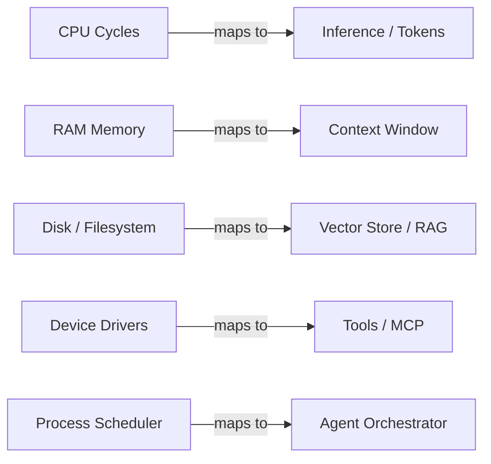

## Overview

An **Agentic OS** is a design paradigm where the **Large Language Model (LLM)** functions conceptually as the **Kernel** of the system. Unlike traditional operating systems designed for human interaction, an Agentic OS is a **backend infrastructure layer** that manages the lifecycle and resources of autonomous software agents.

This concept is foundational to understanding the Agentic OS Protocol (OSP). OSP defines the standardized interfaces and behaviors that implementations of an Agentic OS must follow—the contract that enables different agent systems to interoperate.

## Resource Abstraction

Just as traditional operating systems abstract hardware resources (CPU, memory, disk, devices), an Agentic OS abstracts the cognitive resources of AI systems. The Agentic OS manages cognitive resources just as a traditional kernel manages physical hardware:

- **CPU Cycles → Inference / Tokens**: Managing the compute required for reasoning and generation
- **RAM (Memory) → Context Window**: Managing the finite amount of information active in the model's immediate attention
- **Disk / Filesystem → Vector Store / RAG**: Managing long-term retrieval and persistent knowledge
- **Device Drivers → Tools / MCP**: Standardizing interfaces for external interaction (APIs, browsers, code execution)
- **Process Scheduler → Agent Orchestrator**: Determining which agent runs when, and for how long

Learn more: [System Intelligence](/docs/system/registry)

## The "User" of the OS

In this paradigm, **the "User" of the Operating System is the Agent itself**, not the human.

- The **Agent** requests resources from the OS ("I need to read this file", "I need to store this memory")
- The **OS** enforces permissions, manages limits, and provides the requested capabilities
- The **Human** acts as the external administrator or the user of the *application* built on top of the OS, but does not interact with the Agentic OS layer directly

This distinction is critical: an Agentic OS is the invisible infrastructure that enables complex, multi-agent systems to function reliably at scale.

## Scope and Purpose

The Agentic OS solves **Orchestration Complexity**, not User Experience. Its primary goals are:

1. **Context Hygiene:** Preventing context pollution and managing finite window sizes
2. **Process Isolation:** Ensuring agents operate within defined boundaries without interfering with each other
3. **Inter-Process Communication:** Enabling standardized communication between disparate agents

These goals align directly with the challenges outlined in our [Motivation](/docs/motivation): as systems grow, managing context, isolation, and communication becomes increasingly complex. The Agentic OS provides the infrastructure layer that addresses these challenges systematically.

Learn more: [Motivation](/docs/motivation) | [Architecture](/docs/architecture)

## Agentic OS vs OSP

It's important to understand the distinction:

- **Agentic OS** is the conceptual paradigm—the architectural metaphor
- **OSP (Agentic OS Protocol)** is the specification—the standardized contract that implementations must follow

Just as "operating system" describes a category of software (Linux, Windows, macOS), "Agentic OS" describes a category of systems that manage agent resources. OSP defines the protocol specification that different implementations can follow to achieve interoperability.

Think of it this way: Linux and Windows are both operating systems, but they follow different architectures. Multiple implementations can follow OSP and each be an "Agentic OS" with different internal designs—but they'll all interoperate because they follow the same protocol contract.

## How OSP Implements the Agentic OS

OSP defines the standardized interfaces and behaviors that make an Agentic OS possible:

- **[System](/docs/system)**: Registry, Environment, Filesystem, Sandbox, Settings, Preferences, Installer, MCP Client — the infrastructure layer
- **[Context](/docs/context)**: System Context, Embeddings, Key-Value — read-only facades for the gather phase
- **[Actions](/docs/actions)**: System Actions, Tools, MCP Servers — write facades for the act phase
- **[Checks](/docs/checks/rules)**: Rules, Judge, Audit, Screenshot — verification and quality assurance

These components work together to provide the resource abstraction, process isolation, and inter-process communication that define an Agentic OS.

Learn more: [Architecture](/docs/architecture)

## Next Steps

- Understand the **[Agent Loop](/docs/concepts/agent-loop)**—the core execution pattern within agents
- Explore the **[Agent Lifecycle](/docs/concepts/lifecycle)**—how the OS manages agent resources
- Review **[Workflow Patterns](/docs/concepts/workflows-taxonomy)**—operational execution patterns
