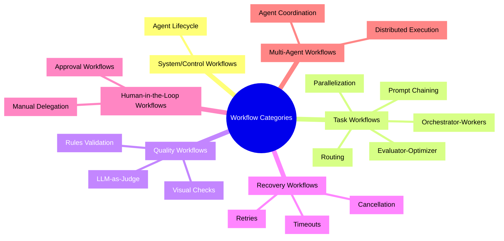

## Overview

Workflows are operational execution patterns that define how tasks are executed during the Execution/Evaluation phases of the [Agent Lifecycle](/docs/concepts/lifecycle). They are macro-level orchestration patterns, distinct from the [Agent Loop](/docs/concepts/agent-loop) (micro-execution) and the Lifecycle (system layer).

## The Six Categories

### 1. System/Control Workflows

Govern agent management at the platform level. The primary workflow is the [Agent Lifecycle](/docs/concepts/lifecycle): Registration → Discovery → Execution → Evaluation.

### 2. Task Workflows

Operational patterns for executing work:
- **[Routing](/docs/workflows/routing)**: Classify inputs and direct to specialized tasks
- **Prompt Chaining**: Sequential steps with validation gates
- **[Orchestrator-Workers](/docs/workflows/orchestrator-worker)**: Central orchestrator delegates to workers
- **[Parallelization](/docs/workflows/parallelization)**: Simultaneous execution with aggregation
- **[Evaluator-Optimizer](/docs/workflows/evaluator-optimizer)**: Generate-evaluate-refine loops

Reference: [Anthropic: Building Effective Agents](https://www.anthropic.com/engineering/building-effective-agents)

### 3. Quality Workflows

Ensure outputs meet standards:
- **[Rules Validation](/docs/checks/rules)**: Defined criteria and constraints
- **[Visual Checks](/docs/checks/screenshot)**: Screenshots and renders
- **[LLM-as-Judge](/docs/checks/judge)**: Model-based evaluation

### 4. Recovery Workflows

Handle failures and errors:
- **[Retries](/docs/runs/retry)**: Automatic retry mechanisms
- **[Timeouts](/docs/runs/timeout)**: Long-running operation handling
- **[Cancellation](/docs/runs/cancel)**: Graceful termination of running operations

### 5. Human-in-the-Loop Workflows

Integrate human oversight:
- **[Approval Workflows](/docs/runs/approval)**: Human approval before proceeding
- **Manual Delegation**: Human task assignment

### 6. Multi-Agent Workflows

Coordinate multiple agents:
- **Agent Coordination**: Multiple agents working together
- **Distributed Execution**: Tasks distributed across agents

## Key Distinctions

- **Workflows** are macro-level orchestration patterns used *during* Execution/Evaluation
- **[Agent Loop](/docs/concepts/agent-loop)** is the micro-level cognitive cycle *inside* workflows
- **[Lifecycle](/docs/concepts/lifecycle)** is the system-level governance *around* workflows

## Next Steps

- Explore specific [Task Workflows](/docs/workflows/routing)
- Understand [Quality Assurance](/docs/checks/audit) mechanisms
- Learn about [Recovery Patterns](/docs/runs/retry)
- Read the full specification in [AGENTS.md Section 3](https://github.com/synerops/osprotocol/blob/main/AGENTS.md#3-workflow-patterns)

