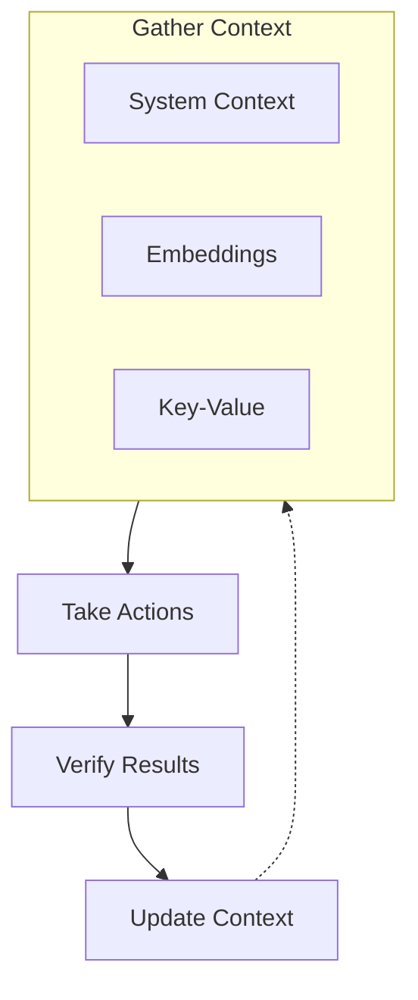

## Overview

The Context domain provides application-specific context and data management for agents. It enables agents to access, store, and retrieve information needed for intelligent decision-making and task execution.

Context is one of the three pillars of the agent loop: **Gather Context** → Take Actions → Verify Results.

## Context APIs

| API | Description |
|-----|-------------|
| [System Context](/docs/context/system) | Read-only composition of all system Context interfaces |
| [Embeddings](/docs/context/embeddings) | Vector embeddings for semantic search |
| [Key-Value Store](/docs/context/kv) | Key-value persistence for the agent loop |

## Role in Agent Loop

Context provides the foundation for informed agent behavior:

## Usage

Context is accessed through the `context` protocol domain. `SystemContext` composes all system read interfaces into a single entry point. `Embeddings` and `KV` are agent-facing read/write interfaces for semantic search and key-value persistence respectively.

## Integration

Context integrates with:

- **System**: Accesses system-level information
- **Actions**: Provides context for action execution
- **Checks**: Context informs quality verification
- **Workflows**: Workflows access context during execution
