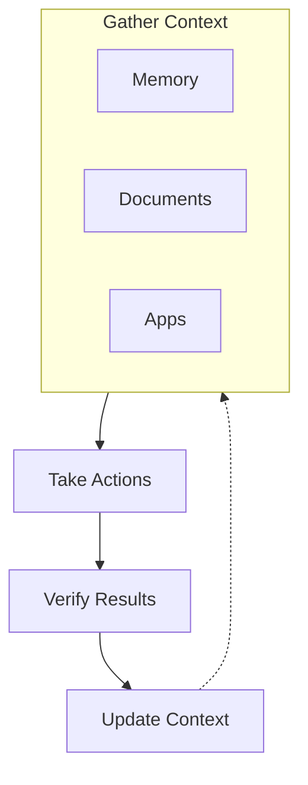

## Overview

The Context domain provides application-specific context and data management for agents. It enables agents to access, store, and retrieve information needed for intelligent decision-making and task execution.

Context is one of the three pillars of the agent loop: **Gather Context** → Take Actions → Verify Results.

## Context APIs

| API | Description |
|-----|-------------|
| [Apps](/docs/context/apps) | Application-specific context and configuration |
| [Documents](/docs/context/documents) | Document processing and management |
| [Embeddings](/docs/context/embeddings) | Vector embeddings for semantic search |
| [Memory](/docs/context/memory) | Persistent memory and knowledge storage |
| [Persistence](/docs/context/persistence) | Data persistence and caching |
| [System](/docs/context/system) | System-level context information |

## Role in Agent Loop

Context provides the foundation for informed agent behavior:



## Usage

Context is accessed through the `context` protocol domain:

```yaml
# In AGENT.md
tools:
  - context.memory
  - context.documents
  - context.embeddings
```

Agents query context to understand the current state, retrieve relevant information, and make informed decisions before taking actions.

## Integration

Context integrates with:

- **System**: Accesses system-level information
- **Actions**: Provides context for action execution
- **Checks**: Context informs quality verification
- **Workflows**: Workflows access context during execution
