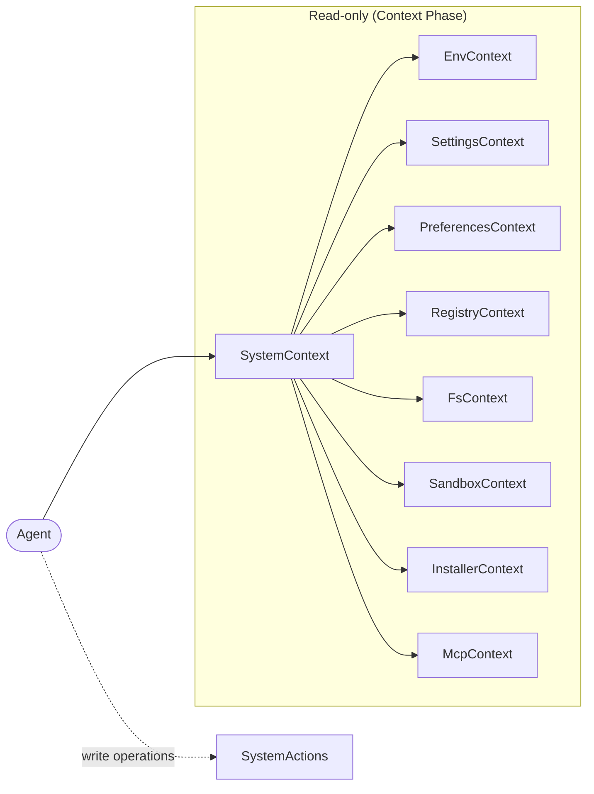

<Callout type="warn">
  This interface is experimental — no production implementation exists yet.
  The API surface may change.
</Callout>

## Overview

`SystemContext` is the read-only facade that composes all system Context interfaces into a single entry point. It is used during the context (gather) phase of the agent loop, giving agents a unified view of system state without the ability to mutate it. Write operations are handled by the counterpart: [SystemActions](/docs/actions/system).

## Architecture

`SystemContext` is pure composition — it adds no logic of its own, only grouping each system API's read-only Context interface under one namespace. `SystemActions` mirrors this structure for write operations.



## TypeScript API

```ts
import type { SystemContext } from '@osprotocol/schema/context/system'
```

### SystemContext

Composes all system read-only interfaces.

```ts
interface SystemContext {
  env: EnvContext
  settings: SettingsContext
  preferences: PreferencesContext
  registry: RegistryContext
  fs: FsContext
  sandbox: SandboxContext
  installer: InstallerContext
  mcp: McpContext
}
```

## Composed Interfaces

| Property | Type | Provides | Docs |
|---|---|---|---|
| `env` | `EnvContext` | Read environment variables (get, list) | [Env](/docs/system/env) |
| `settings` | `SettingsContext` | Read system-wide settings (get, list) | [Settings](/docs/system/settings) |
| `preferences` | `PreferencesContext` | Read per-agent or per-user preferences by scope (get, list) | [Preferences](/docs/system/preferences) |
| `registry` | `RegistryContext` | Discover and look up registered resources (get, list) | [Registry](/docs/system/registry) |
| `fs` | `FsContext` | Read host filesystem entries (read, list, exists) | [Fs](/docs/system/fs) |
| `sandbox` | `SandboxContext` | Inspect existing sandbox environments (get, list) | [Sandbox](/docs/system/sandbox) |
| `installer` | `InstallerContext` | Inspect installed packages and their status (get, list) | [Installer](/docs/system/installer) |
| `mcp` | `McpContext` | Inspect MCP server connections and available tools (get, list) | [MCP Client](/docs/system/mcp-client) |

## Usage Examples

### Check environment and preferences together

An agent reads an environment variable and resolves a user preference in the same context phase before deciding how to act.

```ts
async function resolveOutputConfig(system: SystemContext) {
  const dbUrl = await system.env.get('DATABASE_URL')
  const formatPref = await system.preferences.get('output.format', 'user')

  return {
    databaseUrl: dbUrl?.value ?? null,
    outputFormat: formatPref?.value ?? 'json',
  }
}
```

### Inspect installed packages and MCP connections

An agent audits what capabilities are currently available before deciding whether to proceed with a task.

```ts
async function auditCapabilities(system: SystemContext) {
  const [packages, mcpServers] = await Promise.all([
    system.installer.list(),
    system.mcp.list(),
  ])

  const hasSchemaPackage = packages.some(
    (p) => p.name === '@osprotocol/schema' && p.status === 'installed'
  )

  const connectedServers = mcpServers.filter((s) => s.status === 'connected')

  return { hasSchemaPackage, connectedServers }
}
```

## Integration

- **[SystemActions](/docs/actions/system)**: The write counterpart — same system interfaces, mutation operations
- **[EnvContext](/docs/system/env)**: Environment variable read interface
- **[SettingsContext](/docs/system/settings)**: System-wide settings read interface
- **[PreferencesContext](/docs/system/preferences)**: Scoped preferences read interface
- **[RegistryContext](/docs/system/registry)**: Resource registry read interface
- **[FsContext](/docs/system/fs)**: Host filesystem read interface
- **[SandboxContext](/docs/system/sandbox)**: Sandbox inspection interface
- **[InstallerContext](/docs/system/installer)**: Installed packages read interface
- **[McpContext](/docs/system/mcp-client)**: MCP server connections read interface
