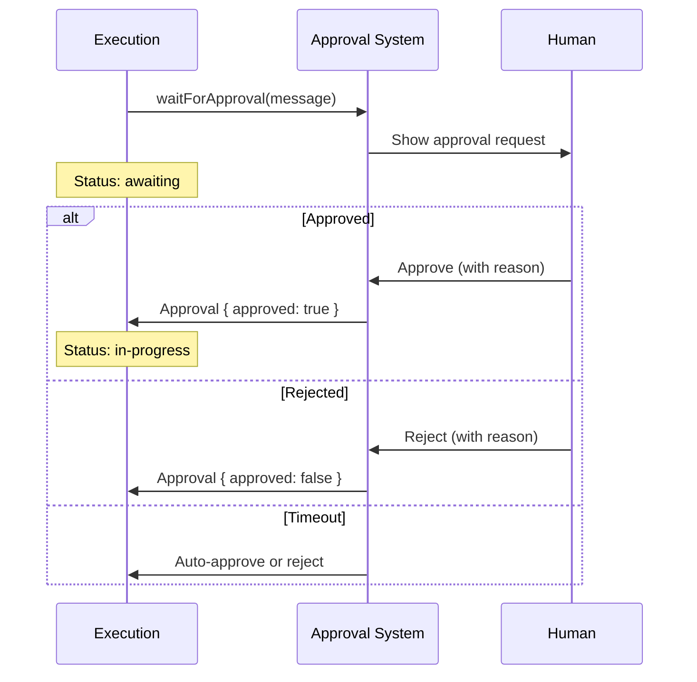

## Overview

The approval system enables human oversight of workflow execution. It provides approval requests, multi-approver workflows, and configurable timeout behavior for critical checkpoints.



## TypeScript API

```ts
import type {
  Approval,
  ApprovalConfig,
  ApprovalRequest
} from '@osprotocol/schema/runs/approval'
```

### Approval

Result of an approval request.

```ts
interface Approval {
  /** Whether the action was approved */
  approved: boolean
  /** Optional reason for the decision */
  reason?: string
  /** Identifier of who approved (user ID, email, etc.) */
  approvedBy?: string
  /** When the approval decision was made */
  timestamp: Date
}
```

### ApprovalConfig

Configuration for approval requests.

```ts
interface ApprovalConfig {
  /** Default timeout for approval requests (milliseconds) */
  timeoutMs?: number
  /** Whether to auto-approve after timeout */
  autoApproveOnTimeout?: boolean
  /** List of users who can approve */
  approvers?: string[]
  /** Minimum approvals required (for multi-approval scenarios) */
  requiredApprovals?: number
}
```

### ApprovalRequest

A pending request for human approval.

```ts
interface ApprovalRequest {
  /** Unique identifier for this request */
  id: string
  /** Message describing what needs approval */
  message: string
  /** Execution ID this request belongs to */
  executionId: string
  /** When the request was created */
  createdAt: Date
  /** When the request expires */
  expiresAt?: Date
  /** Current approval responses */
  responses: Approval[]
}
```

## Usage Example

```ts
// Request approval during execution
const approval = await execution.waitForApproval(
  'Deploy to production environment?'
)

if (approval.approved) {
  console.log(`Approved by ${approval.approvedBy}: ${approval.reason}`)
  // Continue with deployment
} else {
  console.log(`Denied: ${approval.reason}`)
  // Handle rejection
}
```

## Multi-Approval Workflows

For critical operations requiring multiple approvers:

```ts
const config: ApprovalConfig = {
  timeoutMs: 3600000, // 1 hour
  approvers: ['alice@company.com', 'bob@company.com'],
  requiredApprovals: 2,
  autoApproveOnTimeout: false
}
```

## Integration

Approval integrates with:

- **Execution**: Pauses execution until approval
- **Timeout**: Approval requests can expire
- **Cancel**: Rejected approvals can trigger cancellation
