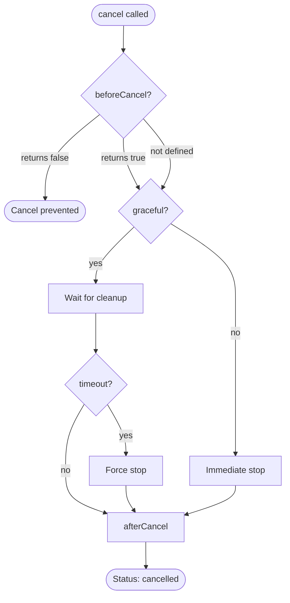

## Overview

The cancel system provides mechanisms to cancel running workflows gracefully. It supports cancellation hooks, cleanup operations, and configurable grace periods for in-progress work.

## TypeScript API

```ts
import type { Cancel } from 'osprotocol/runs/cancel'
```

### Cancel

Cancel configuration for workflow runs.

```ts
interface Cancel {
  /**
   * Called before cancellation proceeds
   * Return false to prevent cancellation
   */
  beforeCancel?: () => boolean | Promise<boolean>

  /**
   * Called after cancellation completes
   */
  afterCancel?: () => void

  /**
   * Optional reason for cancellation
   */
  reason?: string

  /**
   * Whether to wait for cleanup before resolving
   */
  graceful?: boolean

  /**
   * Timeout for graceful cancellation in milliseconds
   */
  gracefulTimeoutMs?: number
}
```

## Usage Examples

### Simple Cancellation

```ts
// Cancel an execution
await execution.cancel('User requested stop')
```

### Cancellation with Cleanup

```ts
const cancel: Cancel = {
  graceful: true,
  gracefulTimeoutMs: 5000,
  beforeCancel: async () => {
    // Check if safe to cancel
    const canCancel = await checkSafeToCancel()
    return canCancel
  },
  afterCancel: () => {
    // Cleanup resources
    cleanupTempFiles()
    closeConnections()
  }
}
```

### Preventing Cancellation

```ts
const cancel: Cancel = {
  beforeCancel: () => {
    if (criticalOperationInProgress) {
      console.log('Cannot cancel during critical operation')
      return false // Prevent cancellation
    }
    return true
  }
}
```

### Graceful Shutdown

```ts
const cancel: Cancel = {
  graceful: true,
  gracefulTimeoutMs: 10000, // 10 second grace period
  reason: 'System shutdown',
  afterCancel: () => {
    notifyDependentSystems()
  }
}
// Waits up to 10 seconds for graceful cleanup
// Forces cancellation if cleanup exceeds timeout
```

## Cancellation Flow



## Integration

Cancel integrates with:

- **RunOptions**: Configure cancel behavior for runs
- **Timeout**: Timeouts can trigger cancellation
- **Execution**: Cancel is called via execution.cancel()
- **Approval**: Rejected approvals may trigger cancellation
