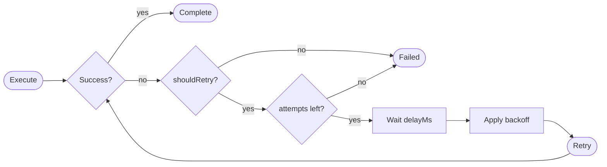

## Overview

The retry system provides configurable retry behavior for failed operations. It supports multiple backoff strategies, conditional retries, and callbacks for monitoring retry attempts.



## Backoff Strategies

| Strategy | Description |
|----------|-------------|
| `none` | No delay increase between retries |
| `linear` | Delay increases linearly (delay * attempt) |
| `exponential` | Delay doubles each attempt (delay * 2^attempt) |

## TypeScript API

```ts
import type { Retry, Backoff } from '@osprotocol/schema/runs/retry'
```

### Backoff

Available backoff strategies for retry delays.

```ts
type Backoff = 'none' | 'linear' | 'exponential'
```

### Retry

Retry configuration for workflow runs.

```ts
interface Retry {
  /** Maximum number of retry attempts */
  attempts: number
  /** Initial delay between retries in milliseconds */
  delayMs: number
  /** Backoff strategy (default: 'none') */
  backoff?: Backoff
  /** Maximum delay when using backoff (milliseconds) */
  maxDelayMs?: number
  /** Callback on each retry attempt */
  onRetry?: (error: Error, attempt: number) => void
  /** Optional predicate to determine if error is retryable */
  shouldRetry?: (error: Error) => boolean
}
```

## Usage Examples

### Simple Retry

```ts
const retry: Retry = {
  attempts: 3,
  delayMs: 1000
}
// Retries up to 3 times with 1 second between each attempt
```

### Exponential Backoff

```ts
const retry: Retry = {
  attempts: 5,
  delayMs: 100,
  backoff: 'exponential',
  maxDelayMs: 10000,
  onRetry: (error, attempt) => {
    console.log(`Retry ${attempt}: ${error.message}`)
  }
}
// Delays: 100ms, 200ms, 400ms, 800ms, 1600ms (capped at 10000ms)
```

### Conditional Retry

```ts
const retry: Retry = {
  attempts: 3,
  delayMs: 500,
  shouldRetry: (error) => {
    // Only retry network errors
    return error.name === 'NetworkError'
  }
}
```

## Delay Calculation

| Strategy | Attempt 1 | Attempt 2 | Attempt 3 | Attempt 4 |
|----------|-----------|-----------|-----------|-----------|
| `none` | delayMs | delayMs | delayMs | delayMs |
| `linear` | delayMs | 2 * delayMs | 3 * delayMs | 4 * delayMs |
| `exponential` | delayMs | 2 * delayMs | 4 * delayMs | 8 * delayMs |

## Integration

Retry integrates with:

- **RunOptions**: Configure retry behavior for runs
- **Timeout**: Retries respect timeout constraints
- **Cancel**: Pending retries can be cancelled
