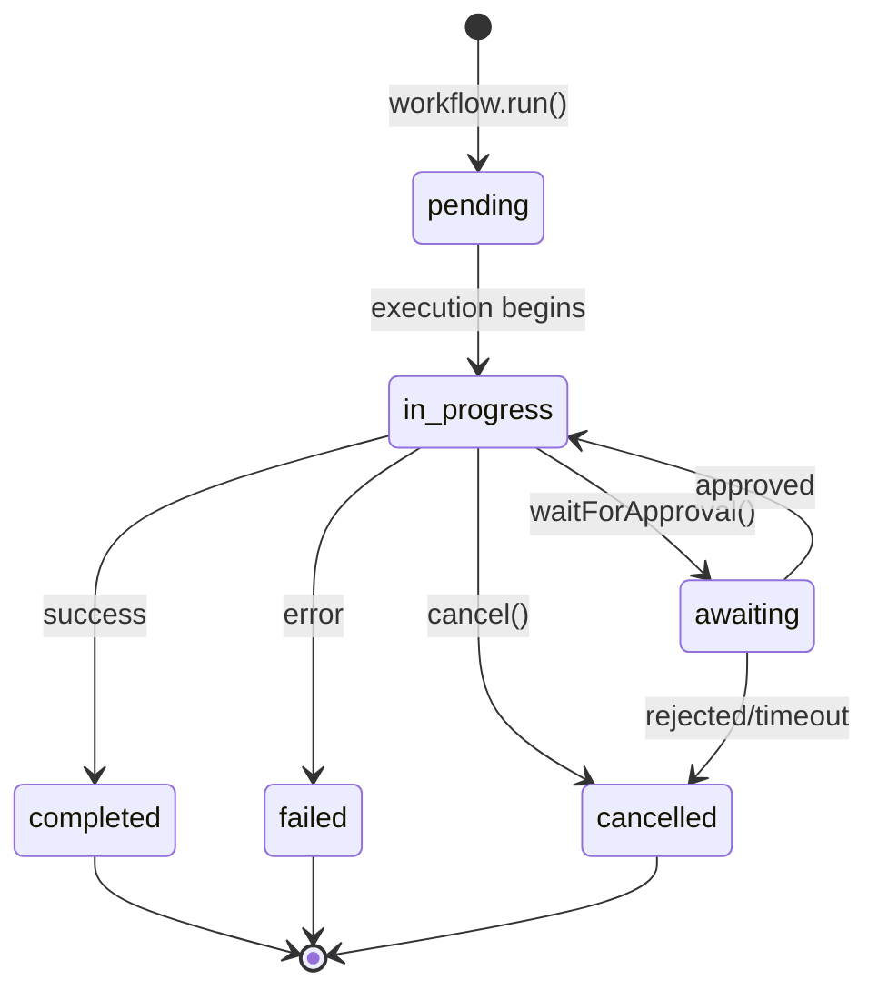

## Overview

Executions represent an active workflow run with full lifecycle control. The run system provides status tracking, progress monitoring, and execution control through pause, resume, and cancel operations.

Creating a run IS starting it — `workflow.run()` returns an active `Execution` handle directly. This aligns with the [Agent Communication Protocol (ACP)](https://agentcommunicationprotocol.dev/core-concepts/agent-run-lifecycle).

## Lifecycle



## TypeScript API

```ts
import type {
  RunOptions,
  RunStatus,
  Execution,
  ExecutionProgress
} from 'osprotocol/runs'
```

### RunStatus

The possible states of a workflow execution.

```ts
type RunStatus =
  | 'pending'      // Execution is queued/initializing
  | 'in-progress'  // Execution is actively running
  | 'awaiting'     // Execution is waiting for human input/approval
  | 'completed'    // Execution finished successfully
  | 'failed'       // Execution encountered an error
  | 'cancelled'    // Execution was cancelled
```

### RunOptions

Options for configuring a workflow run.

```ts
interface RunOptions<Output> {
  /** Timeout configuration */
  timeout?: Timeout
  /** Retry configuration */
  retry?: Retry
  /** Cancel configuration */
  cancel?: Cancel
  /** Callback when run completes successfully */
  onComplete?: (result: Output) => void
  /** Callback when run fails */
  onFailed?: (error: Error) => void
  /** Callback on each status change */
  onStatusChange?: (status: RunStatus) => void
}
```

### Execution

Active execution handle for controlling a running workflow.

```ts
interface Execution<Output> {
  /** Unique identifier for this execution */
  id: string
  /** Current status */
  status: RunStatus
  /** Progress information */
  progress: ExecutionProgress
  /** Execution logs */
  logs: string[]

  /** Pause the execution (if supported) */
  pause(): Promise<void>

  /** Resume a paused execution */
  resume(): Promise<void>

  /** Cancel the execution */
  cancel(reason?: string): Promise<void>

  /** Request human approval before continuing */
  waitForApproval(message?: string): Promise<Approval>

  /** Request input from a human */
  waitForInput<Input>(prompt: string): Promise<Input>

  /** The final result of the execution (resolves when complete) */
  result: Promise<Output>
}
```

### ExecutionProgress

Progress tracking for an execution.

```ts
interface ExecutionProgress {
  /** Current step number */
  current: number
  /** Total number of steps (0 if unknown) */
  total: number
  /** Description of current step */
  message?: string
}
```

## Usage Example

```ts
// Run a workflow and get an active execution
const execution = await workflow.run(prompt, {
  timeout: { ms: 30000 },
  retry: { attempts: 3, delayMs: 1000 },
  onStatusChange: (status) => console.log('Status:', status)
})

// Monitor progress
console.log(`Progress: ${execution.progress.current}/${execution.progress.total}`)

// Wait for result
const result = await execution.result
```

## Integration

Execution integrates with:

- **Timeout**: Enforce time limits on execution
- **Retry**: Automatically retry on failure
- **Cancel**: Graceful cancellation support
- **Approval**: Human-in-the-loop checkpoints
