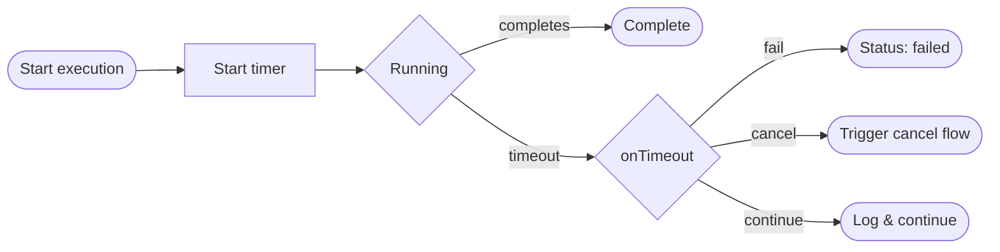

## Overview

The timeout system manages time limits for workflow execution. It ensures operations complete within specified durations and provides configurable actions for timeout scenarios.



## Timeout Actions

| Action | Description |
|--------|-------------|
| `fail` | Mark the run as failed on timeout (default) |
| `cancel` | Trigger graceful cancellation on timeout |
| `continue` | Log timeout but allow execution to continue |

## TypeScript API

```ts
import type { Timeout, TimeoutAction } from 'osprotocol/runs/timeout'
```

### TimeoutAction

Action to take when a timeout occurs.

```ts
type TimeoutAction = 'fail' | 'cancel' | 'continue'
```

### Timeout

Timeout configuration for workflow runs.

```ts
interface Timeout {
  /** Timeout duration in milliseconds */
  ms: number
  /** Action to take when timeout occurs (default: 'fail') */
  onTimeout?: TimeoutAction
  /** Callback function when timeout occurs */
  onTimeoutCallback?: () => void
}
```

## Usage Examples

### Simple Timeout

```ts
const timeout: Timeout = {
  ms: 30000 // 30 seconds
}
// Fails the run if not complete within 30 seconds
```

### Graceful Cancellation

```ts
const timeout: Timeout = {
  ms: 60000, // 1 minute
  onTimeout: 'cancel',
  onTimeoutCallback: () => {
    console.log('Timeout reached, initiating graceful shutdown')
  }
}
// Triggers cancellation flow instead of immediate failure
```

### Warning Without Failure

```ts
const timeout: Timeout = {
  ms: 120000, // 2 minutes
  onTimeout: 'continue',
  onTimeoutCallback: () => {
    sendAlert('Operation exceeding expected duration')
  }
}
// Logs warning but allows execution to continue
```

## Integration

Timeout integrates with:

- **RunOptions**: Configure timeout for workflow runs
- **Cancel**: Timeout can trigger cancellation flow
- **Retry**: Retries reset the timeout clock
- **Execution**: Status changes to failed/cancelled on timeout
