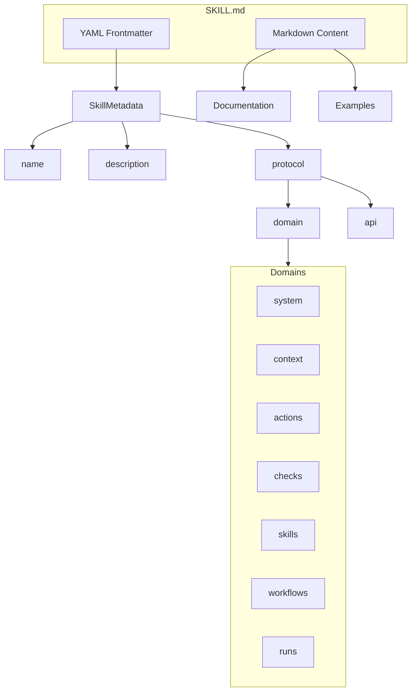

## Overview

Skills are capabilities and APIs that agents can use. Each skill is defined in a `SKILL.md` file with YAML frontmatter metadata and markdown content containing documentation and examples. Skills belong to protocol domains and expose tools for agent use.



## SKILL.md Structure

```markdown
---
name: file-reader
description: Read files from the filesystem
protocol:
  domain: system
  api: fs
extends: base-skill
---

# File Reader

Documentation for this skill including usage examples.

## Usage

This skill provides file reading capabilities...
```

## Protocol Domains

Skills are organized into protocol domains:

| Domain | Description |
|--------|-------------|
| `system` | System-level APIs (registry, env, fs, installer, etc.) |
| `context` | Application context and data management |
| `actions` | Action execution (tools, MCP servers, ops) |
| `checks` | Quality assurance (rules, audit, judge, fallback) |
| `skills` | Skill management and discovery |
| `workflows` | Workflow pattern execution |
| `runs` | Run lifecycle control |

## TypeScript API

```ts
import type {
  Skill,
  SkillMetadata,
  ProtocolDomain,
  ProtocolReference,
  SkillRegistryEntry,
  Tool,
  LoadedSkill
} from '@osprotocol/schema/skill'
```

### ProtocolDomain

The available protocol domain categories.

```ts
type ProtocolDomain =
  | 'system'
  | 'context'
  | 'actions'
  | 'checks'
  | 'skills'
  | 'workflows'
  | 'runs'
```

### ProtocolReference

Reference to a protocol domain and API.

```ts
interface ProtocolReference {
  /** The protocol domain */
  domain: ProtocolDomain
  /** The API name within the domain */
  api: string
}
```

### Skill

The full skill definition including metadata and content.

```ts
interface Skill {
  /** Metadata from YAML frontmatter */
  metadata: SkillMetadata
  /** Markdown content (documentation, examples) */
  content: string
  /** File path where skill was loaded from */
  path: string
}
```

### SkillMetadata

Metadata extracted from the YAML frontmatter in `SKILL.md`.

```ts
interface SkillMetadata {
  /** Unique identifier for the skill */
  name: string
  /** Human-readable description */
  description: string
  /** Protocol reference */
  protocol: ProtocolReference
  /** Parent skill to extend from (optional) */
  extends?: string
}
```

### SkillRegistryEntry

Registry entry for skill discovery.

```ts
interface SkillRegistryEntry {
  /** Skill name */
  name: string
  /** Protocol domain */
  domain: ProtocolDomain
  /** API name */
  api: string
  /** File path to SKILL.md */
  path: string
  /** Whether skill definition has been loaded */
  loaded: boolean
}
```

### Tool

Tool definition for skill tools. Each skill can expose multiple tools.

```ts
interface Tool<TParams = unknown, TResult = unknown> {
  /** Tool description */
  description: string
  /** JSON schema for parameters */
  parameters?: object
  /** Execute the tool */
  execute(params: TParams): Promise<TResult>
}
```

### LoadedSkill

A skill that has been loaded with its tools ready for use.

```ts
interface LoadedSkill {
  /** Skill definition */
  definition: Skill
  /** Available tools (from tools/ directory) */
  tools: Record<string, Tool>
}
```

## Integration

Skills integrate with:

- **Registry**: Skills are registered for discovery by domain
- **Agents**: Agents declare which skill tools they can use
- **Actions**: Skills expose tools through the actions system
- **MCP**: Skills can wrap MCP server capabilities
