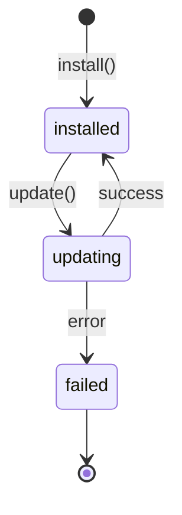

<Callout type="warn">
  This interface is experimental — no production implementation exists yet.
  The API surface may change.
</Callout>

## Overview

The Installer is the kernel's package manager, responsible for adding capabilities to the system at runtime. It installs, updates, and removes skills, tools, and extensions without requiring a system restart. Provider backends include npm, pip, Claude Code Skills, and Homebrew.

## Install Status



## TypeScript API

```ts
import type {
  InstallStatus,
  InstallEntry,
  InstallerContext,
  InstallerActions,
  Installer,
} from 'osprotocol/system/installer'
```

### InstallStatus

```ts
type InstallStatus = 'installed' | 'updating' | 'failed'
```

The lifecycle state of a managed package.

| Value | Description |
|-------|-------------|
| `installed` | Package is present and ready to use |
| `updating` | An update is in progress |
| `failed` | The last install or update operation failed |

### InstallEntry

```ts
interface InstallEntry {
  name: string
  version: string
  status: InstallStatus
  installedAt: number
  metadata?: Record<string, unknown>
}
```

A record describing a managed package. `installedAt` is a Unix timestamp (milliseconds). `metadata` carries provider-specific data (e.g., checksums, source URLs).

### InstallerContext

```ts
interface InstallerContext {
  get(name: string): Promise<InstallEntry | null>
  list(): Promise<InstallEntry[]>
}
```

Read-only gather phase. Use `InstallerContext` to inspect what is currently installed without triggering side effects.

| Method | Description |
|--------|-------------|
| `get(name)` | Returns the `InstallEntry` for `name`, or `null` if not installed |
| `list()` | Returns all managed `InstallEntry` records |

### InstallerActions

```ts
interface InstallerActions {
  install(name: string, version?: string): Promise<InstallEntry>
  uninstall(name: string): Promise<boolean>
  update(name: string, version?: string): Promise<InstallEntry>
}
```

Write act phase. Use `InstallerActions` to mutate the set of installed packages.

| Method | Description |
|--------|-------------|
| `install(name, version?)` | Installs the package. Resolves to the resulting `InstallEntry` |
| `uninstall(name)` | Removes the package. Resolves to `true` on success |
| `update(name, version?)` | Updates the package, optionally pinning a version |

### Installer

```ts
interface Installer {
  install(name: string, version?: string): Promise<InstallEntry>
  uninstall(name: string): Promise<boolean>
  get(name: string): Promise<InstallEntry | null>
  list(): Promise<InstallEntry[]>
  update(name: string, version?: string): Promise<InstallEntry>
}
```

The combined interface. `Installer` merges `InstallerContext` and `InstallerActions` into a single object that a kernel implementation exposes to agents.

## Usage Examples

### Install a package

```ts
const entry = await installer.install('@osprotocol/skill-web-search')
console.log(entry.status) // 'installed'
console.log(entry.version) // e.g. '1.2.0'
```

### List installed packages

```ts
const packages = await installer.list()
for (const pkg of packages) {
  console.log(`${pkg.name}@${pkg.version} — ${pkg.status}`)
}
```

### Update a package

```ts
const updated = await installer.update('@osprotocol/skill-web-search', '2.0.0')
if (updated.status === 'installed') {
  console.log('Update succeeded')
} else {
  console.error('Update failed')
}
```

## Integration

- [Registry](/docs/system/registry) — discover available skills and tools before installing
- [MCP Client](/docs/system/mcp-client) — manages installed MCP servers exposed to agents
