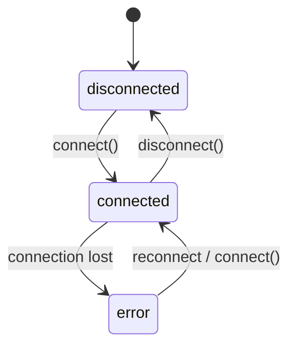

<Callout type="warn">
  This interface is experimental — no production implementation exists yet.
  The API surface may change.
</Callout>

## Overview

`McpClient` is the kernel's connection manager for external MCP (Model Context Protocol) servers. It handles the infrastructure side of MCP integration: establishing connections, tracking server status, and exposing available tools to the rest of the system.

This is distinct from the agent-facing side. The agent-facing interface for discovering and invoking MCP tools lives in [MCP Servers](/docs/actions/mcp-servers). Think of `McpClient` as the device driver manager — it keeps connections alive so that agents can use them through higher-level APIs.

Provider examples: Claude Code MCP, Cursor MCP, VS Code Copilot MCP.

## Connection Lifecycle



## TypeScript API

```ts
import type {
  McpServerStatus,
  McpServerEntry,
  McpContext,
  McpActions,
  McpClient,
} from '@osprotocol/schema/system/mcp-client'
```

### McpServerStatus

```ts
type McpServerStatus = 'connected' | 'disconnected' | 'error'
```

Represents the current state of an MCP server connection.

| Value | Description |
|---|---|
| `connected` | Server is reachable and active |
| `disconnected` | Server is not connected |
| `error` | Connection attempt failed or was interrupted |

### McpServerEntry

```ts
interface McpServerEntry {
  name: string
  uri: string
  status: McpServerStatus
  tools?: string[]
  metadata?: Record<string, unknown>
}
```

A record describing a registered MCP server. `tools` lists the tool names exposed by the server. `metadata` holds any additional provider-specific information.

### McpContext

```ts
interface McpContext {
  get(name: string): Promise<McpServerEntry | null>
  list(): Promise<McpServerEntry[]>
}
```

Read-only gather phase. Used to inspect the current state of registered servers without modifying connections.

### McpActions

```ts
interface McpActions {
  connect(name: string, uri: string): Promise<McpServerEntry>
  disconnect(name: string): Promise<boolean>
}
```

Write/act phase. Used to establish or tear down server connections.

### McpClient

```ts
interface McpClient {
  connect(name: string, uri: string): Promise<McpServerEntry>
  disconnect(name: string): Promise<boolean>
  get(name: string): Promise<McpServerEntry | null>
  list(): Promise<McpServerEntry[]>
}
```

The unified interface combining both context and actions. `McpClient` is the primary surface for code that needs both read and write access to MCP connections.

## Usage Examples

### Connect to an MCP server

```ts
const entry = await mcpClient.connect(
  'claude-code',
  'mcp://localhost:3100'
)

console.log(entry.status)  // 'connected'
console.log(entry.tools)   // ['read_file', 'write_file', ...]
```

### List all connected servers and their tools

```ts
const servers = await mcpClient.list()

for (const server of servers) {
  if (server.status === 'connected') {
    console.log(`${server.name}: ${server.tools?.join(', ')}`)
  }
}
```

### Disconnect a server

```ts
const ok = await mcpClient.disconnect('claude-code')
console.log(ok)  // true
```

## System MCP Client vs Actions MCP Servers

| | `system/mcp-client` | `actions/mcp-servers` |
|---|---|---|
| Layer | Infrastructure / kernel | Agent-facing |
| Responsibility | Manage server connections | Invoke tools on connected servers |
| Who uses it | System internals, orchestrators | Agents, skills |
| Phase | Context (read) + Actions (write) | Actions |
| Example | `connect()`, `disconnect()`, `list()` | `callTool()`, `listTools()` |

The system client keeps connections alive. The actions interface exposes those connections as callable tools for agents.

## Integration

- [MCP Servers (actions)](/docs/actions/mcp-servers) — agent-facing tool invocation over MCP connections managed here
- [Registry](/docs/system/registry) — discover available MCP servers before connecting
- [Installer](/docs/system/installer) — provision and install MCP server binaries or packages
