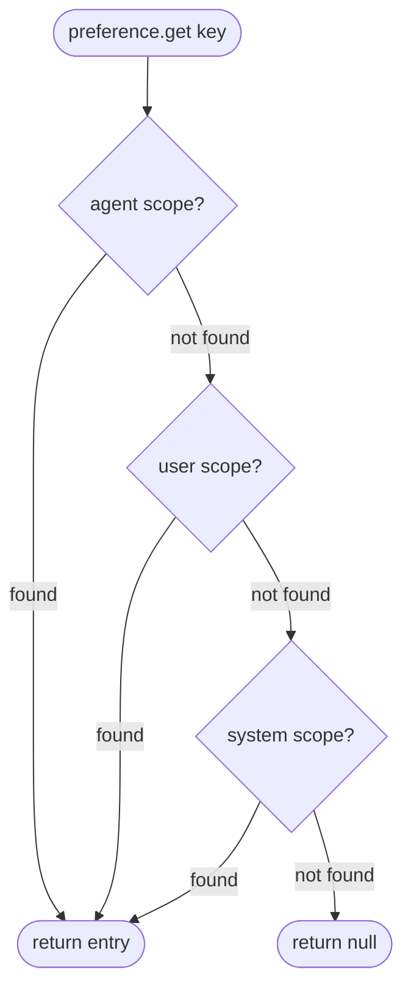

<Callout type="warn">
  This interface is experimental — no production implementation exists yet. The
  API surface may change.
</Callout>

## Overview

The `Preferences` interface provides kernel-level storage for per-agent and per-user configuration that customizes agent behavior without affecting the global system. Unlike system-wide settings, preferences are scoped — each entry belongs to an `agent`, `user`, or `system` scope — and resolved in cascade order: agent overrides user, user overrides system. Familiar provider analogs include VS Code Settings, Claude Code Scoped Config, and GitHub User Preferences.

## Scope Resolution

When an agent requests a preference value, the kernel checks scopes from most specific to least specific. The first match wins.



## TypeScript API

```ts
import type {
  Preferences,
  PreferenceEntry,
  PreferenceScope,
  PreferencesContext,
  PreferencesActions,
} from '@osprotocol/schema/system/preferences'
```

### PreferenceScope

The three available scopes for a preference entry.

```ts
type PreferenceScope = 'agent' | 'user' | 'system'
```

### PreferenceEntry

A single preference value with its scope and optional metadata.

```ts
interface PreferenceEntry<T = unknown> {
  key: string
  value: T
  scope: PreferenceScope
  metadata?: Record<string, unknown>
}
```

### PreferencesContext

Read-only access for the context phase of the agent loop.

```ts
interface PreferencesContext {
  get<T = unknown>(key: string, scope: PreferenceScope): Promise<PreferenceEntry<T> | null>
  list(scope: PreferenceScope): Promise<PreferenceEntry[]>
}
```

### PreferencesActions

Write operations for the actions phase of the agent loop.

```ts
interface PreferencesActions {
  set<T = unknown>(key: string, value: T, scope: PreferenceScope): Promise<PreferenceEntry<T>>
  remove(key: string, scope: PreferenceScope): Promise<boolean>
}
```

### Preferences

Full preferences management interface combining context and actions.

```ts
interface Preferences {
  get<T = unknown>(key: string, scope: PreferenceScope): Promise<PreferenceEntry<T> | null>
  set<T = unknown>(key: string, value: T, scope: PreferenceScope): Promise<PreferenceEntry<T>>
  remove(key: string, scope: PreferenceScope): Promise<boolean>
  list(scope: PreferenceScope): Promise<PreferenceEntry[]>
}
```

## Usage Examples

### Read an agent-scoped preference

Agent-scoped preferences take priority over user or system values with the same key.

```ts
const entry = await preferences.get<string>('output.format', 'agent')

if (entry) {
  console.log(entry.key)   // 'output.format'
  console.log(entry.value) // 'json'
  console.log(entry.scope) // 'agent'
}
```

### Set a user-scoped preference

User-scoped preferences apply across agents that have not overridden the key at the agent scope.

```ts
await preferences.set('output.format', 'markdown', 'user')
```

### Implement the cascade manually

When you need to resolve a value across all scopes in priority order:

```ts
async function resolve<T>(
  preferences: Preferences,
  key: string,
): Promise<T | null> {
  const scopes: PreferenceScope[] = ['agent', 'user', 'system']

  for (const scope of scopes) {
    const entry = await preferences.get<T>(key, scope)
    if (entry !== null) return entry.value
  }

  return null
}

const format = await resolve<string>(preferences, 'output.format')
```

## Integration

- **[Settings](/docs/system/settings)**: System-wide configuration that acts as the baseline before preference scopes are applied
- **[Environment](/docs/system/env)**: Platform-level variables for credentials and deployment targets; preferences handle behavioral customization above that layer
- **[Registry](/docs/system/registry)**: Agent registration metadata may include default preference values that seed the agent scope at registration time
