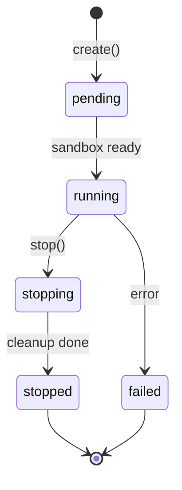

<Callout type="warn">
  This interface is experimental — no production implementation exists yet.
  The API surface may change.
</Callout>

## Overview

The sandbox interface manages isolated execution environments for agent workloads. Agents that write and run code need isolation — a contained filesystem, command execution, optional network access, and automatic cleanup. The protocol defines the convergent surface across providers like Vercel Sandbox, E2B, Cloudflare Workers, and Docker.



## TypeScript API

```ts
import type {
  Sandbox,
  SandboxEntry,
  SandboxConfig,
  SandboxStatus,
  SandboxContext,
  SandboxActions,
  CommandResult,
  SandboxFile,
} from '@osprotocol/schema/system/sandbox'
```

### SandboxStatus

Lifecycle states for a sandbox.

```ts
type SandboxStatus = 'pending' | 'running' | 'stopping' | 'stopped' | 'failed'
```

### SandboxEntry

Summary of a sandbox instance.

```ts
interface SandboxEntry {
  /** Unique sandbox identifier */
  id: string
  /** Current lifecycle status */
  status: SandboxStatus
  /** When the sandbox was created (Unix ms) */
  createdAt: number
  /** Remaining time before auto-stop (ms) */
  timeout?: number
  /** Extensible metadata for provider-specific data */
  metadata?: Record<string, unknown>
}
```

### SandboxConfig

Configuration for creating a new sandbox.

```ts
interface SandboxConfig {
  /** Runtime or template identifier (e.g., "node24", "python3.13") */
  runtime?: string
  /** Initial timeout in milliseconds before auto-stop */
  timeout?: number
  /** Environment variables to inject */
  env?: Record<string, string>
  /** Ports to expose for external access */
  ports?: number[]
  /** Extensible metadata for provider-specific data */
  metadata?: Record<string, unknown>
}
```

### CommandResult

Result of executing a command inside a sandbox.

```ts
interface CommandResult {
  /** Process exit code (0 = success) */
  exitCode: number
  /** Standard output */
  stdout: string
  /** Standard error */
  stderr: string
  /** Extensible metadata for provider-specific data */
  metadata?: Record<string, unknown>
}
```

### SandboxFile

A file within the sandbox filesystem.

```ts
interface SandboxFile {
  /** File path within the sandbox */
  path: string
  /** File contents */
  content: string
}
```

### Sandbox

Full sandbox management interface.

```ts
interface Sandbox {
  create(config?: SandboxConfig): Promise<SandboxEntry>
  get(id: string): Promise<SandboxEntry | null>
  list(): Promise<SandboxEntry[]>
  stop(id: string): Promise<boolean>
  exec(id: string, command: string, args?: string[]): Promise<CommandResult>
  readFile(id: string, path: string): Promise<string | null>
  writeFiles(id: string, files: SandboxFile[]): Promise<void>
  getUrl(id: string, port: number): Promise<string | null>
  extendTimeout(id: string, duration: number): Promise<void>
}
```

### SandboxContext

Read-only view for the context phase of the agent loop.

```ts
interface SandboxContext {
  get(id: string): Promise<SandboxEntry | null>
  list(): Promise<SandboxEntry[]>
}
```

### SandboxActions

Write operations for the actions phase of the agent loop.

```ts
interface SandboxActions {
  create(config?: SandboxConfig): Promise<SandboxEntry>
  stop(id: string): Promise<boolean>
  exec(id: string, command: string, args?: string[]): Promise<CommandResult>
  writeFiles(id: string, files: SandboxFile[]): Promise<void>
  readFile(id: string, path: string): Promise<string | null>
  getUrl(id: string, port: number): Promise<string | null>
  extendTimeout(id: string, duration: number): Promise<void>
}
```

## Usage Examples

### Create a sandbox and run code

```ts
const entry = await sandbox.create({
  runtime: 'node24',
  timeout: 120000,
  env: { NODE_ENV: 'production' },
})

await sandbox.writeFiles(entry.id, [
  { path: 'index.ts', content: 'console.log("hello from sandbox")' },
])

const result = await sandbox.exec(entry.id, 'npx', ['tsx', 'index.ts'])
// result.stdout → 'hello from sandbox'
// result.exitCode → 0
```

### Expose a web server

```ts
const entry = await sandbox.create({
  runtime: 'node24',
  ports: [3000],
})

await sandbox.writeFiles(entry.id, [
  { path: 'server.js', content: 'require("http").createServer((_, res) => res.end("ok")).listen(3000)' },
])

await sandbox.exec(entry.id, 'node', ['server.js'])
const url = await sandbox.getUrl(entry.id, 3000)
// url → 'https://sandbox-abc123.provider.dev'
```

### Extend timeout for long-running tasks

```ts
const entry = await sandbox.create({ timeout: 60000 })

// Task is taking longer than expected
await sandbox.extendTimeout(entry.id, 60000) // +60s

// Clean up when done
await sandbox.stop(entry.id)
```

## Sandbox vs Filesystem

| | Sandbox (`system/sandbox`) | Filesystem (`system/fs`) |
|---|---|---|
| **Scope** | Isolated environment with own filesystem | Host/platform filesystem |
| **Execution** | Can run commands (`exec`) | No execution capability |
| **Lifecycle** | Created, used, destroyed | Always available |
| **Network** | Optional port exposure | N/A |
| **Use case** | Run untrusted code, test builds, serve previews | Read configs, persist artifacts |

## Integration

Sandbox integrates with:

- **[Filesystem](/docs/system/fs)**: Host fs for persistent artifacts, sandbox fs for ephemeral execution
- **[Environment](/docs/system/env)**: Sandbox inherits or overrides environment variables
- **[Timeout](/docs/runs/timeout)**: Sandbox timeout is independent of run timeout — both can apply
- **[Screenshot](/docs/checks/screenshot)**: Visual verification of sandbox-served web previews
