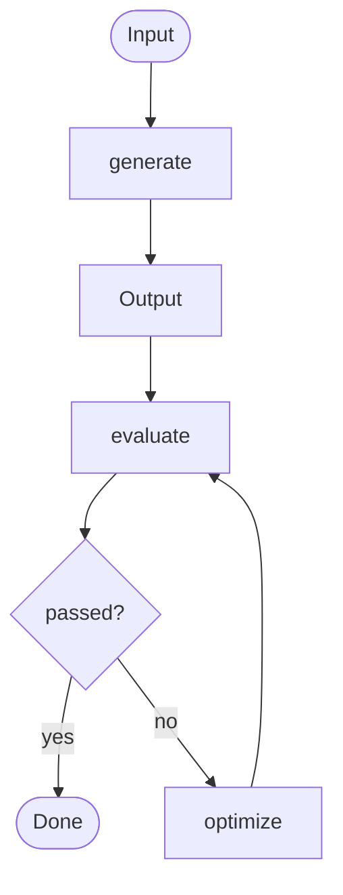

<Callout type="warn">
  This workflow pattern is part of the OS Protocol specification.
  The interfaces below describe the expected contract; implementations
  must honor the scoring range (0.0–1.0) and respect maxIterations
  to avoid infinite refinement loops.
</Callout>

## Overview

The Evaluator-Optimizer workflow runs an iterative generate-evaluate-optimize loop, continuing to refine output until a quality threshold is met or the maximum number of iterations is exhausted. Each cycle produces structured feedback that the optimizer uses to improve the next generation attempt. This pattern is best suited to quality-critical tasks where initial outputs are unlikely to meet standards without targeted refinement.

## Pattern



## TypeScript API

```ts
import type {
  Evaluation,
  CriterionResult,
  EvaluationCriterion,
  EvaluatorOptimizerWorkflow,
  EvaluatorOptimizerConfig,
} from "@osprotocol/schema/workflows/evaluator-optimizer"
```

### Evaluation

Result returned by `evaluate()`. The `score` is a float between 0.0 and 1.0. `passed` indicates whether the score meets the configured threshold. `feedback` is a human-readable explanation. `criteria` provides a per-criterion breakdown when multiple evaluation dimensions are configured.

```ts
interface Evaluation {
  score: number
  passed: boolean
  feedback: string
  criteria?: CriterionResult[]
}
```

### CriterionResult

Per-criterion scoring entry inside an `Evaluation`. Mirrors `EvaluationCriterion` but carries the measured `score` and `passed` result for a single generation attempt.

```ts
interface CriterionResult {
  name: string
  score: number
  passed: boolean
  feedback?: string
}
```

### EvaluationCriterion

Declares a single quality dimension used during evaluation. `threshold` sets the minimum acceptable score (0.0–1.0) for this criterion. `weight` controls its relative contribution when computing the aggregate score; weights across all criteria should sum to 1.0.

```ts
interface EvaluationCriterion {
  name: string
  description: string
  threshold: number
  weight?: number
}
```

### EvaluatorOptimizerWorkflow

Extends the base `Workflow<Output>` interface with the three methods that implement the loop. `generate` produces an initial output from the prompt. `evaluate` scores that output and returns structured feedback. `optimize` uses the output and evaluation to produce an improved version.

```ts
interface EvaluatorOptimizerWorkflow<Output> extends Workflow<Output> {
  generate(prompt: string): Promise<Output>
  evaluate(output: Output, prompt: string): Promise<Evaluation>
  optimize(output: Output, evaluation: Evaluation, prompt: string): Promise<Output>
}
```

### EvaluatorOptimizerConfig

Configuration passed when constructing the workflow. `threshold` sets the global pass score (default 0.8). `maxIterations` caps the refinement loop. `criteria` declares the evaluation dimensions. `generatorModel` and `evaluatorModel` allow using different models for generation and evaluation—useful when a smaller, faster model generates and a larger, more critical model evaluates.

```ts
interface EvaluatorOptimizerConfig {
  threshold?: number
  maxIterations?: number
  criteria?: EvaluationCriterion[]
  generatorModel?: string
  evaluatorModel?: string
}
```

## Usage Examples

### Basic generation loop

Runs the loop until the output passes the global threshold or `maxIterations` is reached.

```ts
const result = await workflow.run("Write a concise executive summary for Q4 results", {
  config: {
    threshold: 0.85,
    maxIterations: 4,
  },
})
```

### Multi-criteria evaluation

Defines separate quality dimensions with individual thresholds and weights. The aggregate score is a weighted sum of criterion scores.

```ts
const result = await workflow.run("Draft a technical proposal for the new caching layer", {
  config: {
    threshold: 0.80,
    maxIterations: 5,
    criteria: [
      {
        name: "technical_accuracy",
        description: "Claims are technically correct and current",
        threshold: 0.90,
        weight: 0.5,
      },
      {
        name: "clarity",
        description: "Language is clear and free of ambiguity",
        threshold: 0.75,
        weight: 0.3,
      },
      {
        name: "completeness",
        description: "All required sections are present and addressed",
        threshold: 0.70,
        weight: 0.2,
      },
    ],
  },
})
```

### Different models for generation and evaluation

Uses a fast model to generate and a more capable model to evaluate, balancing cost against quality.

```ts
const result = await workflow.run("Translate the following legal clause to plain English", {
  config: {
    threshold: 0.90,
    maxIterations: 3,
    generatorModel: "claude-haiku-4-5",
    evaluatorModel: "claude-opus-4-6",
  },
})
```

## Integration

- [Routing](/docs/workflows/routing) — route inputs to the appropriate generator before entering the loop
- [Orchestrator-Workers](/docs/workflows/orchestrator-workers) — use evaluator-optimizer as a worker in a larger orchestration
- [Parallelization](/docs/workflows/parallelization) — run multiple generation candidates in parallel and evaluate each
- [Judge](/docs/checks/judge) — reuse judge checks as evaluation criteria inside this workflow
- [Runs](/docs/runs) — control timeout, retry, and cancellation for the refinement loop
