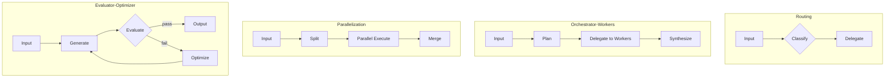

## Overview

Workflows define execution patterns for agent tasks. All workflow types extend the base `Workflow` interface. The OS Protocol implements patterns based on [Anthropic's building blocks for agentic systems](https://www.anthropic.com/engineering/building-effective-agents).



## Available Patterns

| Pattern | Description | When to Use |
|---------|-------------|-------------|
| [Routing](/docs/workflows/routing) | Classify and delegate | Single specialized handler needed |
| [Orchestrator-Workers](/docs/workflows/orchestrator-worker) | Plan, delegate, synthesize | Multiple specialized capabilities |
| [Parallelization](/docs/workflows/parallelization) | Split, execute in parallel, merge | Independent subtasks |
| [Evaluator-Optimizer](/docs/workflows/evaluator-optimizer) | Generate, evaluate, refine | Quality is critical |

## TypeScript API

```ts
import type { Workflow, InferWorkflowOutput } from '@osprotocol/schema/workflows'
```

### Workflow

Base interface that all workflow patterns implement.

```ts
interface Workflow<Output> {
  /**
   * Execute the workflow with the given prompt
   *
   * @param prompt - The input prompt/task to process
   * @param options - Optional run configuration (timeout, retry, cancel, etc.)
   * @returns Promise resolving to the workflow output
   */
  run(prompt: string, options?: RunOptions<Output>): Promise<Output>
}
```

### InferWorkflowOutput

Utility type to extract the output type from a workflow.

```ts
type InferWorkflowOutput<T> = T extends Workflow<infer Output>
  ? Output
  : never
```

## Usage Example

```ts
import type { Workflow, RunOptions } from '@osprotocol/schema/workflows'

// Define a custom workflow
const myWorkflow: Workflow<string> = {
  async run(prompt, options) {
    // Execute workflow logic
    return `Processed: ${prompt}`
  }
}

// Run with options
const result = await myWorkflow.run('Hello', {
  timeout: { ms: 30000 },
  retry: { attempts: 3, delayMs: 1000 }
})
```

## Composing Workflows

Workflows can be composed to create complex execution patterns:

```ts
// Routing delegates to specialized workflows
const router: RoutingWorkflow<string> = {
  async classify(prompt) {
    // Determine which workflow to use
    return prompt.includes('code') ? 'code-assistant' : 'general'
  },
  async run(prompt, options) {
    const route = await this.classify(prompt)
    return workflows[route].run(prompt, options)
  }
}
```

## Integration

Workflows integrate with:

- **RunOptions**: Configure timeout, retry, and cancel behavior
- **Agents**: Agents declare which workflow patterns they can use
- **Execution**: Workflows create executions with lifecycle control
