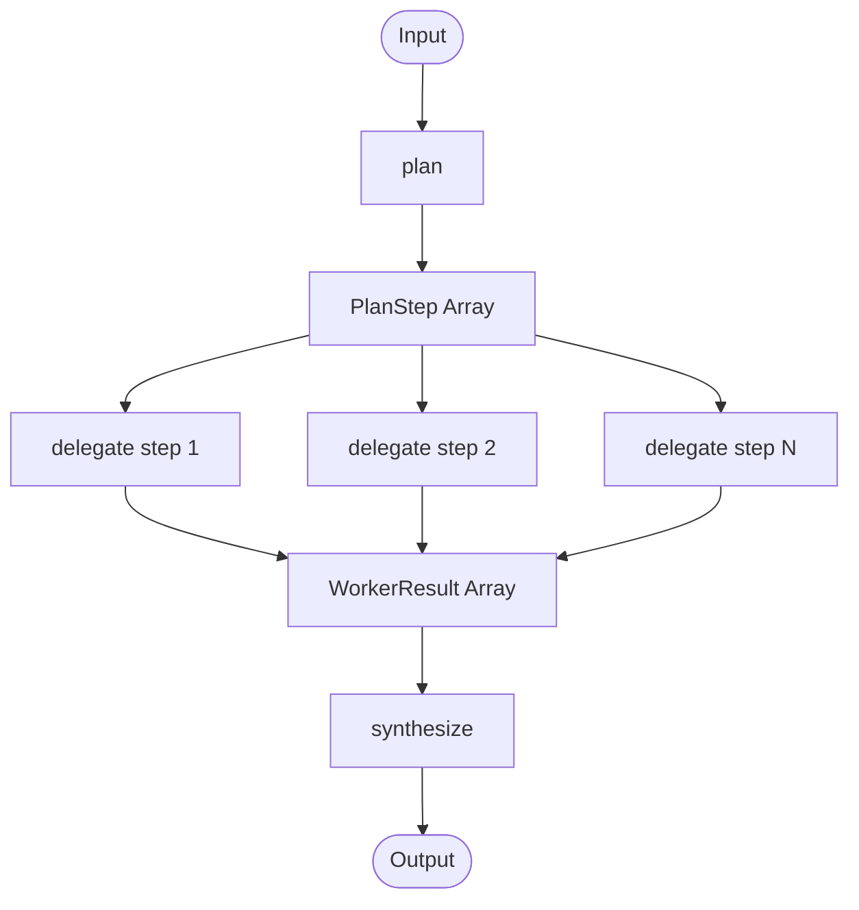

<Callout type="warn">
  This workflow pattern is experimental. Interfaces are subject to change
  as the OS Protocol specification evolves.
</Callout>

## Overview

The Orchestrator-Workers pattern uses a central orchestrator to decompose a complex task into a structured plan, delegate each step to a specialized worker, and synthesize the collected results into a final output. It is the most powerful multi-agent pattern for tasks that require multiple specialized capabilities working together. Workers operate independently on their assigned steps, and the orchestrator aggregates their results with full awareness of the original goal.

## Pattern Diagram



## TypeScript API

Import from `osprotocol/workflows/orchestrator-workers`.

### PlanStep

A single unit of work in the execution plan.

```ts
interface PlanStep {
  id: string
  description: string
  worker: string
  input: string
  dependsOn?: string[]
}
```

- `id` — unique identifier for the step
- `description` — human-readable summary of what the step does
- `worker` — name of the worker responsible for this step
- `input` — the prompt or data passed to the worker
- `dependsOn` — optional list of step IDs that must complete before this step runs

### Plan

The full execution plan produced by the orchestrator.

```ts
interface Plan {
  steps: PlanStep[]
  goal: string
}
```

- `steps` — ordered list of steps to execute
- `goal` — the original objective driving the plan

### WorkerResult

The result returned by a worker after executing a step.

```ts
interface WorkerResult<T = unknown> {
  stepId: string
  worker: string
  success: boolean
  data?: T
  error?: string
}
```

- `stepId` — the ID of the step this result corresponds to
- `worker` — name of the worker that produced the result
- `success` — whether the step completed without error
- `data` — the output produced by the worker on success
- `error` — error message if the step failed

### OrchestratorWorkersWorkflow

The main interface extending the base `Workflow`.

```ts
interface OrchestratorWorkersWorkflow<Output> extends Workflow<Output> {
  plan(prompt: string): Promise<Plan>
  delegate(step: PlanStep): Promise<WorkerResult>
  synthesize(results: WorkerResult[], plan: Plan): Promise<Output>
}
```

- `plan` — generates a structured `Plan` from the input prompt
- `delegate` — sends a single `PlanStep` to the assigned worker and returns a `WorkerResult`
- `synthesize` — combines all results with the original plan to produce the final `Output`

### WorkerConfig

Configuration for registering a worker with the orchestrator.

```ts
interface WorkerConfig {
  name: string
  description: string
  workflow: Workflow<unknown>
  capabilities: string[]
}
```

- `name` — unique identifier used in `PlanStep.worker`
- `description` — what this worker is specialized to do
- `workflow` — the underlying workflow the worker executes
- `capabilities` — list of capability tags used for worker selection

## Usage Examples

### Create a Plan and Execute

```ts
const result = await orchestrator.run("Research and summarize AI agent frameworks")

// Or step by step:
const plan = await orchestrator.plan("Research and summarize AI agent frameworks")

const results: WorkerResult[] = []
for (const step of plan.steps) {
  const result = await orchestrator.delegate(step)
  results.push(result)
}

const output = await orchestrator.synthesize(results, plan)
```

### Register Workers

```ts
const workers: WorkerConfig[] = [
  {
    name: "researcher",
    description: "Searches the web and retrieves relevant information",
    workflow: searchWorkflow,
    capabilities: ["search", "retrieve", "browse"],
  },
  {
    name: "analyst",
    description: "Analyzes data and identifies patterns",
    workflow: analysisWorkflow,
    capabilities: ["analyze", "compare", "rank"],
  },
  {
    name: "writer",
    description: "Drafts and edits written content",
    workflow: writingWorkflow,
    capabilities: ["write", "summarize", "edit"],
  },
]
```

### Handle Step Dependencies

Use `dependsOn` to ensure steps run in the correct order when outputs from one step feed into another.

```ts
const plan: Plan = {
  goal: "Produce a competitive analysis report",
  steps: [
    {
      id: "step-1",
      description: "Gather data on competitor A",
      worker: "researcher",
      input: "Find key features and pricing for Competitor A",
    },
    {
      id: "step-2",
      description: "Gather data on competitor B",
      worker: "researcher",
      input: "Find key features and pricing for Competitor B",
    },
    {
      id: "step-3",
      description: "Write comparative analysis",
      worker: "writer",
      input: "Compare the two competitors based on research results",
      dependsOn: ["step-1", "step-2"],
    },
  ],
}

// Execute steps respecting dependencies
for (const step of plan.steps) {
  const deps = step.dependsOn ?? []
  const depsComplete = deps.every(id =>
    results.find(r => r.stepId === id && r.success)
  )
  if (depsComplete) {
    results.push(await orchestrator.delegate(step))
  }
}
```

## Integration

- [Routing](/docs/workflows/routing) — use routing to select which orchestrator handles an incoming task
- [Parallelization](/docs/workflows/parallelization) — combine with parallelization to execute independent steps concurrently
- [Evaluator-Optimizer](/docs/workflows/evaluator-optimizer) — wrap synthesized output in an evaluator loop for iterative refinement
- [Runs](/docs/runs) — configure timeouts, retries, and approval gates on orchestrator runs
