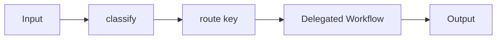

<Callout type="warn">
  This interface is experimental — no production implementation exists yet. The API surface may change.
</Callout>

## Overview

The Routing workflow classifies an incoming prompt and delegates it to a single specialized workflow based on the classification result. It is the simplest multi-agent pattern — it routes but does not aggregate results across multiple branches. The design follows Anthropic's routing building block from "Building Effective Agents."

## Pattern



## TypeScript API

Import from `@osprotocol/schema/workflows/routing`. The base `Workflow` interface is available from `@osprotocol/schema/workflows`.

### RouteConfig

Describes when a route should be selected and provides optional examples for few-shot classification.

```ts
interface RouteConfig {
  description: string
  whenToUse: string[]
  examples?: string[]
}
```

### RoutingWorkflow

Extends the base `Workflow` interface with a `classify` method that returns the key of the matched route.

```ts
interface RoutingWorkflow<Output> extends Workflow<Output> {
  classify(prompt: string): Promise<string>
}
```

### RoutingWorkflowConfig

Top-level configuration object. `workflows` is a record keyed by route name, each value being a `RoutingWorkflowEntry`.

```ts
interface RoutingWorkflowConfig<Output> {
  model?: string
  workflows: Record<string, RoutingWorkflowEntry<Output>>
}
```

### RoutingWorkflowEntry

Pairs a concrete `Workflow` with its `RouteConfig`. Set `markAsDefault` to `true` on one entry to use it as the fallback when no route matches.

```ts
interface RoutingWorkflowEntry<Output> {
  workflow: Workflow<Output>
  route: RouteConfig
  markAsDefault?: boolean
}
```

## Usage Examples

### Configure a routing workflow with multiple routes

```ts
const config: RoutingWorkflowConfig<string> = {
  model: "claude-opus-4-6",
  workflows: {
    billing: {
      workflow: billingWorkflow,
      route: {
        description: "Handles billing, invoices, and payment questions.",
        whenToUse: [
          "User asks about an invoice",
          "User wants to update payment method",
          "User reports a charge they do not recognize",
        ],
        examples: [
          "Why was I charged twice this month?",
          "How do I cancel my subscription?",
        ],
      },
    },
    technical: {
      workflow: technicalWorkflow,
      route: {
        description: "Handles technical support and troubleshooting.",
        whenToUse: [
          "User reports a bug or error",
          "User needs help integrating the API",
          "User asks how a feature works",
        ],
      },
    },
    general: {
      workflow: generalWorkflow,
      route: {
        description: "Handles all other questions.",
        whenToUse: ["Input does not match any other route"],
      },
      markAsDefault: true,
    },
  },
}
```

### Classify a prompt to determine the route

```ts
const routeKey = await router.classify("I was charged twice last week.")
// routeKey === "billing"
```

### Run the full routing workflow

```ts
const run = await router.run("I was charged twice last week.")
const result = await run.output()
```

The `run` method internally calls `classify`, selects the matching `RoutingWorkflowEntry`, and delegates execution to its `workflow`. If no route matches, the entry with `markAsDefault: true` is used.

## Integration

- [Orchestrator-Workers](/docs/workflows/orchestrator-workers) — plan, delegate to multiple workers, and synthesize results
- [Parallelization](/docs/workflows/parallelization) — split a task across concurrent workflows
- [Evaluator-Optimizer](/docs/workflows/evaluator-optimizer) — generate, evaluate, and refine output in a loop
- [Runs](/docs/runs) — timeout, retry, cancel, and approval controls for any workflow
